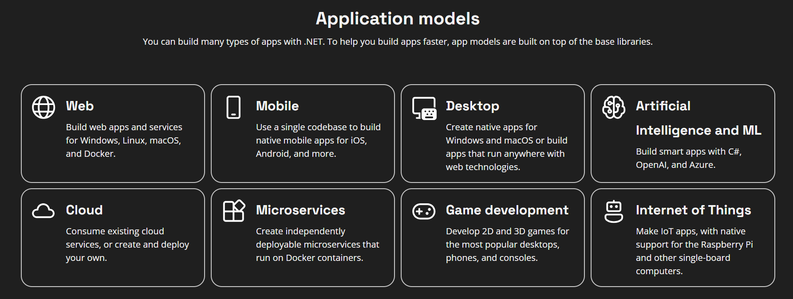
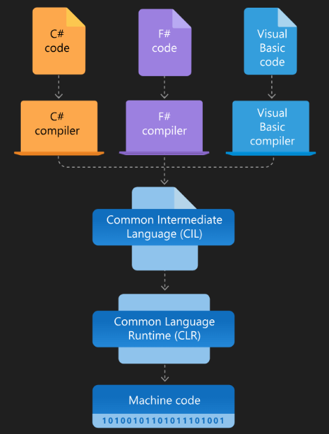

# Keyword: .NET 8

## 1. Khái niệm

- .NET: Trước hết .NET là một nền tảng mở nguồn mở hỗ trợ viết các phần mềm, app với đa ngôn ngữ như C#, F#, Visual Basic.

- .NET: được xem là "cross platform" khi vừa chạy được trên đa nền tảng Window, Linux, MacOS và có thể phát triển trong tốt nhiều lĩnh vực như web, desktop, cloud, game, AI.

- .NET 8: Đây là phiên bản Long Term Support của .NET, cải thiện performance, garbage collection và extension library.

## 2. Mục đích sử dụng

- Xây dựng web api.

- Xây dựng Desktop app (Win form app).

- Xây dựng Mobile app

- Xây các ứng dung khác

  

## 3. Thành phần chính

- Common Language Runtime: có nhiệm vụ là thực thi chương trình, quản lý execution, quản lý thread, garbage collection.

- Base Class Library: thư viện các class hỗ trợ cho các tác vụ đọc, xử lý file,... giúp tối ưu thời gian viết lại code khi có các thư viện hỗ trợ

- Software Development Kit: Công cụ hỗ trợ để build, run và publish app

- Tools: Công cấp nhiều loại application như winform app, mobile app, web app,...

## 4. Cách hoạt động

- Khi thực thi code nó sẽ chuyển mã lệnh thành bytecode. Ở mỗi loại máy chỉ cần một trình biên dịch riêng đều có thể dịch ra mã máy và chạy chương trình.

- Ví dụ: Khi viết mã bằng C#, qua compiler nó sẽ chuyển thành ngôn ngữ trung gian Common Intermediate Language sau đó CLR sẽ dịch mã này thành mã máy.

  

## 5. Demo

Em có demo đơn giản với Console App để test cách thức hoạt động của .NET. Đầu tiên, em khởi tạo dự án Console App trong terminal: dotnet new console. Sau khi tạo được chương trình sẽ em cho chạy test chương trình: dotnet run. Khi chạy compiler sẽ chuyển mã C# thành mã trung gian CIL là file demo.dll, sau đó CLR sẽ dùng JIT Compiler để chuyển CIL thành mã máy và thực thi trên CPU.

## 6. Ưu điểm

- Chạy được đa nền tảng với Windows, Linux, MacOS

- Hiệu năng cao

- Hệ sinh thái phong phú

- Dễ maintain và modify

## 7. Nhược điểm

- Khá tốn chi phí Cost of Licensing khi áp dụng vào dự án thực tế

- Quản lý bộ nhớ chưa tốt: khi tối ưu hóa không cẩn thận các dự án .NET có thể tiêu thụ bộ nhớ cao và rò rỉ bộ nhớ

- Một số thư viện cũ chỉ hỗ trợ trên .NET Framework

## 8. Kiến thức học được

- Hiểu sự khác nhau giữa .NET Framework và .NET 8

- Nắm được cơ chế biên dịch từ C# (ngôn ngữ khác) sang machine code

- Chạy được một ứng dụng đơn giản với Console App.

## 9. Khó khăn gặp phải

- Ban đầu em không hiểu lắm cách hoạt động của .NET ở chỗ cách nó quản lý Garbage Collection. Thì em có đọc qua phần Automatic Memory Management để hiểu thêm về cách mà nó phân bố bộ nhớ khi chạy chương trình.

- Bên cạnh đó em cũng gặp khó trong việc hiểu tại sao .NET có thể chạy song song. Để hiểu được phần này thì em có đọc trên website cũng như xem youtube thì thấy nó sử dụng cơ chế thread pool loại bỏ việc phân bổ thread thủ công và cơ chế async/await giúp xử lý bất đồng bộ.
