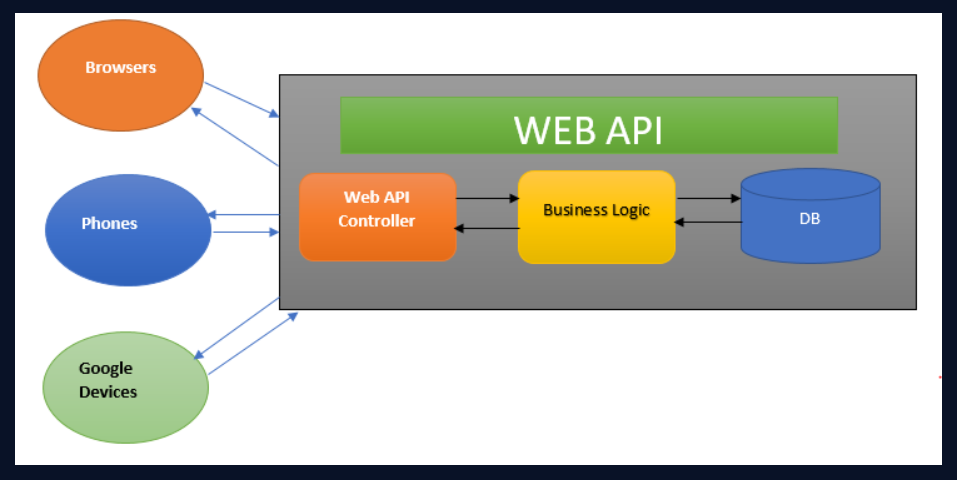
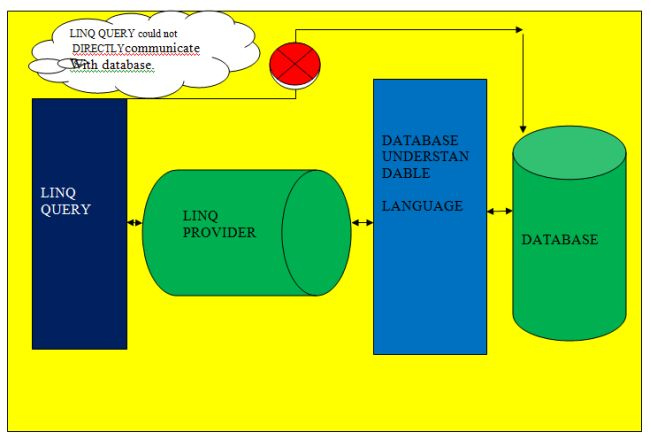
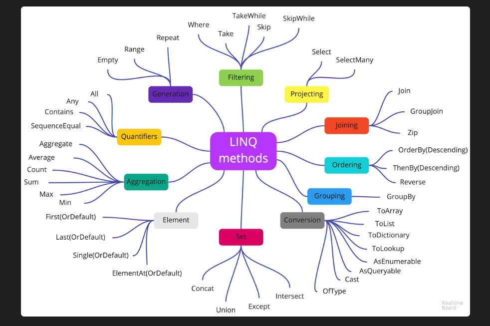
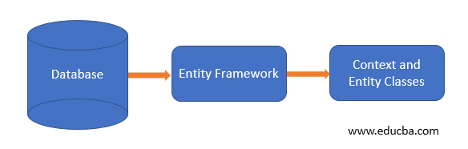
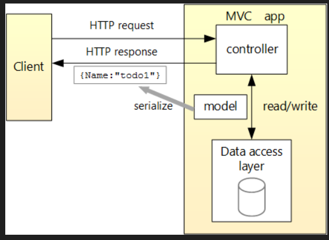
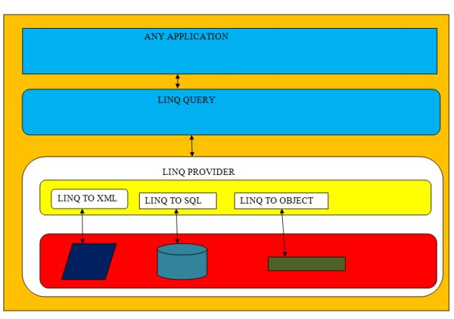
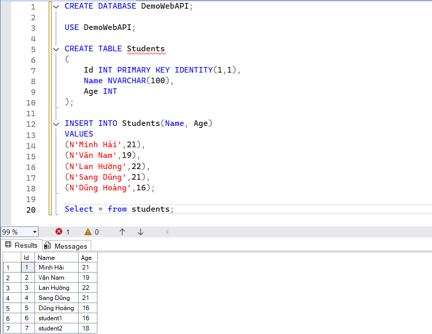
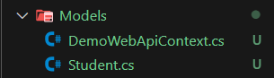

# Keyword: ASP.NET Core Web API, LINQ, Entity Framework Core (DB First)

## 1. Khái niệm

### 1.1 ASP.NET Core Web API

- ASP.NET Core: Là một cross-platform, một framework mã nguồn mở hỗ trợ tools xây dựng các ứng dụng Web hiện đại với .NET như Website, IoT, Mobile Backend - Web API.

- ASP.NET Core Web API là framework trong ASP.NET Core dùng để xây dựng các HTTP API cho phép client giao tiếp với server thông qua các phương thức GET, POST, PUT, DELETE,...

- ASP.NET cung cấp 2 cách tiếp cận để xây dựng HTTP API: Minimal APIs và controller-based API.

### 1.2 LINQ

- LINQ: viết tắt của Language Integrated Query, là một ngôn ngữ truy vấn tích hợp.

- LINQ hỗ trợ lập trình viên các phương thức query để dùng chung cho các loại dữ liệu như SQL database, ADO.NET datasets, XML, dữ liệu từ Web Services,... mà không cần phải định nghĩa riêng biểu thức truy vấn cho từng loại dữ liệu.

### 1.3 Entity Framework Core (DB First)

- Entity Framework: là một "modern object-relation mapper", cho phép chúng ta xây dựng một lớp truy cập dữ liệu hiệu suất cao, gọn gàng và dễ dàng trong việc schema migrations.

- Với EF Core, data access hoạt động bằng việc sử dụng model. Model này được tạo ra từ các entity class và context object - đại diện cho cho một phiên làm việc với database.

- Trong đó Entity Framework DB First là chúng ta đã xây dựng và có được database từ trước, chúng ta chỉ cần xây dựng ngược lại entity classes và DbContext từ database có sẵn mà không cần tạo database table.

## 2. Mục đích sử dụng

### 2.1 ASP.NET Web API

- Xây dựng các phương thức để backend truy cập dữ liệu và gửi dữ liệu về cho frontend.

- Hoạt động như một API service.

### 2.2 LINQ

- Dùng để thực hiện các hành động filter, order, group thông qua query syntax với những dòng code ngắn gọn.

- Thực hiện được trên cùng nhiều loại dữ liệu với cùng query syntax.

- Ví dụ:

```C#
// Specify the data source.
int[] scores = [97, 92, 81, 60];

// Define the query expression.
IEnumerable<int> scoreQuery =
    from score in scores
    where score > 80
    select score;

// Execute the query.
foreach (var i in scoreQuery)
{
    Console.Write(i + " ");
}

// Output: 97 92 81
```

### 2.3 Entity Framework Core (DB First)

- Sử dụng để build một ứng dụng mới khi đã có Database.

- Tạo ra một Data Access Layer hiệu suất cao, dễ dàng Schema Migrations.

## 3. Thành phần chính

### 3.1 ASP.NET Web API

- Web API controller: nơi tiếp nhận request từ client và trả về HTTP request cho client.

- Business Logic: lớp này được tách ra để sử lý nghiệp vụ khi nhận request từ controller và tương tác với Database.

- Database: Lưu trữ database của ứng dụng và trả dữ liệu về cho Business Logic.

<div align="center">
  
</div>

### 3.2 LINQ

- LINQ Query Expression: nơi chứa các biểu thức LINQ dùng để filter, order, group,...

- LINQ Provider: nơi convert LINQ query thành format mà Database có thể hiểu.

- Database: nơi chứa dữ liệu của application

<div align="center">
  
</div>

- LINQ hỗ trợ rất nhiều các phương thức để query dữ liệu:

<div align="center">
  
</div>\

- LINQ to Object: dùng để truy vấn trực tiếp dữ liệu đang nằm trong bộ nhớ RAM. Nhanh và tối ưu với các database nhỏ, khi lọc toàn bộ dữ liệu sẽ load vào bộ nhớ.

- LINQ to Entity: dùng để truy vấn cơ sở dữ liệu (thông qua Entity Framework) bằng cách dịch code LINQ thành câu lệnh SQL và gửi xuống hệ quản trị cơ sở dữ liệu. Tối ưu cho database lớn, chỉ trả về các kết quả cần thiết khi lọc.

### 3.3 Entity Framework Core (DB First)

Với cách tiếp cận DB First, EF Core sẽ generate ra 2 thành phần chính là: DBContext và Entity Classes

- DBContext: Là class trung tâm hoạt động như cổng phiên làm việc tới Database, chịu trách nhiệm quản lý connections, querying và tracking.

- Entity Classes: Là các class đại diện cho các table của database

- DbSet: Tập hợp các đại diện của entity classes.

<div align="center">
  
</div>

## 4. Cách hoạt động

### 4.1 ASP.NET Web API

- Client gửi request tới controller.

- Controller đi qua các model để đọc hoặc chỉnh sửa dữ liệu ở lớp Data Access.

- Sau khi hoàn thành Controller sẽ trả về HTTP response cho Client để hiển thị thao tác đã thành công hay thất bại.

<div align="center">
  
</div>

### 4.2 LINQ

- Ví dụ ứng dụng có backend sử dụng SQL Server, khi đó cần query dữ liệu thành table và trả về cho frontend.

- Khi đó chúng ta sẽ viết LINQ query - đây là cây truy vấn dữ liệu

- LINQ query sẽ qua LINQ provider, sử dụng EF core Provider để chuyển LINQ query thành SQL query. Ở các phiên bản cũ của .NET Framework thì dùng LINQ to SQL.

- Khi đó sql query sẽ được gọi vào database để truy vấn

<div align="center">
  
</div>

### 4.3 Entity Framework Core (DB First)

- Database đã tồn tại

- Sử dụng Scaffold command

- EF Core generate:
  - Entity Classes
  - DbContext

- Ứng dụng dùng DbContext để query dữ liệu

- LINQ được EF Core chuyển thành SQL

## 5. Demo

- Em có tạo một demo đơn giản sử dụng Web API có tích hợp query bằng LINQ và ứng dụng Entity Framework Core (DB First).

- Trước tiên, em tạo một dự án DemoAPI trong thư mục: dotnet new webapi -n DemoAPI --framework net8.0

- Sau khi tạo dự án, em tạo database đơn giản lưu thông tin của học sinh trong SQL Server.

<div align="center">
  
</div>

- Có được database, em sẽ ánh xạ nó thành DBContext và Entity Classes:
<div align="center">
  
</div>

- Sau đó, em có thêm các method để có thể test được trước trên swagger.

- Tiếp theo, khi swagger đã chạy được thì em tiến hành viết controller cho students. Các method em viết bao gồm lấy danh sách, thêm, sửa, xóa học sinh.

- Cuối cùng em thêm html để test với UI.

- Qua demo này em có rút ra được luồng hoạt động của Web API khi tích hợp LINQ và EF Core như sau: Khi client đưa ra một cái http request thì Router sẽ route xem nó là method gì và đưa request cho Controller. Sau khi xác định được method nó sẽ chạy code của method đó. Khi chạy LINQ query trong code sẽ đi qua EF core để chuyển về sql query. Khi query thành công thì kết quả trả về sẽ được theo chiều ngược lại và hiển thị cho user.

## 6. Ưu điểm

### 6.1 ASP.NET Web API

- ASP.NET Core Web API là một cross-platform, chạy được trên Window, Linux, MacOS.

- Hỗ trợ đa dạng nhiều lại data như: XML, JSON.

- Hiệu suất cao và có khả năng scale up tốt.

- Hỗ trợ hosting trên nhiều Web Server khác nhau.

### 6.2 LINQ

- Viết code ngắn gọn, syntax đon giản.

- LINQ query có thể áp dụng cho rất nhiều loại data source nhờ có LINQ provider để chuyển LINQ query thành data source query, mà không cần viết nhiều loại query cho từng data source khác nhau.

- IntelliSense hỗ trợ tốt

### 6.3 Entity Framework Core (DB First)

- Giảm số lượng SQL thủ công

- Tự mapping giữa Object và Database

- Hỗ trợ Migration

- Tích hợp LINQ

## 7. Nhược điểm

### 7.1 ASP.NET Web API

- HTTP response chỉ trả về dữ liệu chứ không bao gồm giao diện.

### 7.2 LINQ

- Query phức tạp có thể khó tối ưu

- Khó kiểm soát SQL được generate

### 7.3 Entity Framework Core (DB First)

- Phụ thuộc cấu trúc database hiện có

- Khó cấu trúc lại model

- Database thay đổi phải scaffold lại

## 8. Kiến thức học được

- Em đã nắm được thế nào là ASP.NET và ASP.NET Core Web API. Hiểu được cách mà nó hoạt động từ lúc nhận request tới lúc trả response.

- Hiểu được concept mà LINQ hoạt động khi chuyển từ LINQ query thành data source query.

- Nắm được luồng hoạt động của Entity Framework Core (DB First).

- Có thể demo đơn giản để tạo ra một Website áp dụng Web API, LINQ và Entity Framework Core (DB First).

## 9. Khó khăn gặp phải

- Ban đầu em chưa hiểu rõ cách thức mà Web API nó hoạt động như nào, đọc thì khá mơ hồ. Để giải quyết vấn đề này em tập trung tìm những phần hình ảnh, sơ đồ hóa cách Web API hoạt động cũng như xem các video trên youtube để được giải thích kỹ hơn.

- Em cũng gặp khó khăn trong việc luồng hoạt động của Web API khi phải tích hợp LINQ để query và cả Entity Framework Core (DB First). Em chưa hiểu sao mà khi người dùng bấm thao tác như thêm sửa xóa thì nó có thể query xuống được database và hiển thị lại với người dùng. Để giải quyết vấn đề này thì em có sẽ kiến trúc của ASP.NET Web API và cả EF Core cũng như test thông qua demo quản lí sinh viên đơn giản, thì em đút kết được những nội dung cốt lõi về luồng hoạt động của Web API như nào khi tích hợp EF Core.
