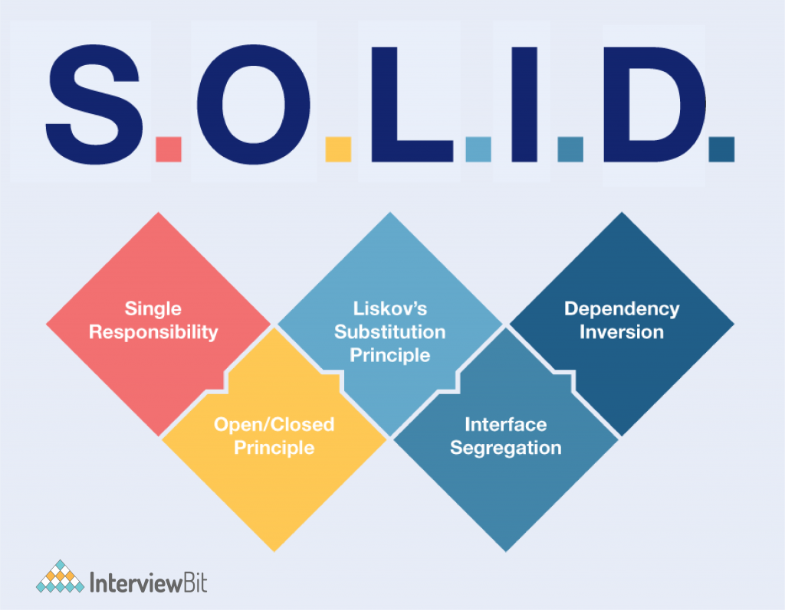
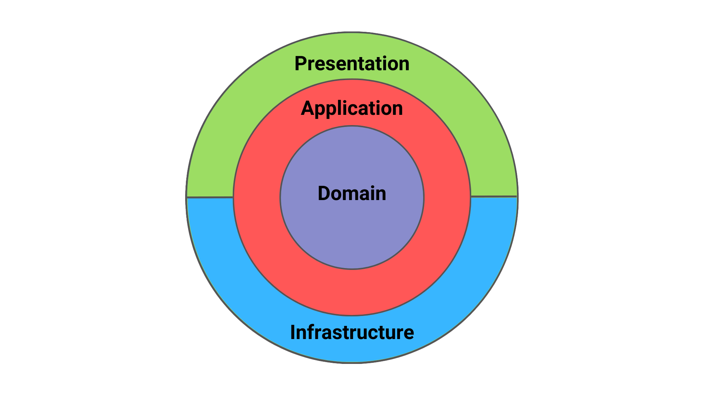
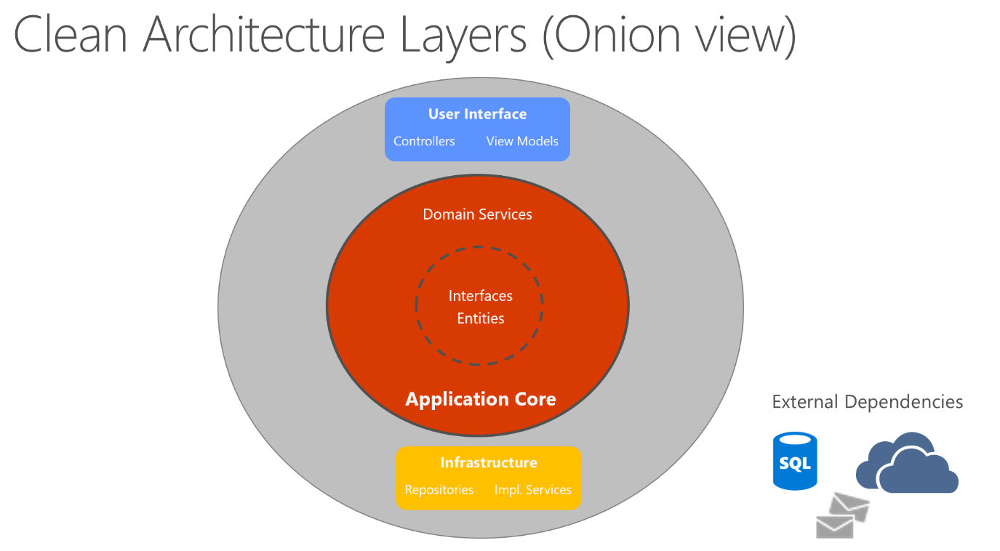
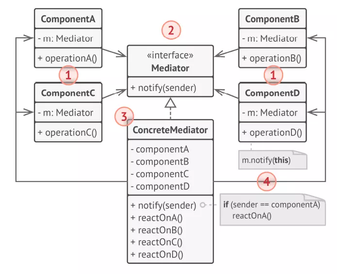
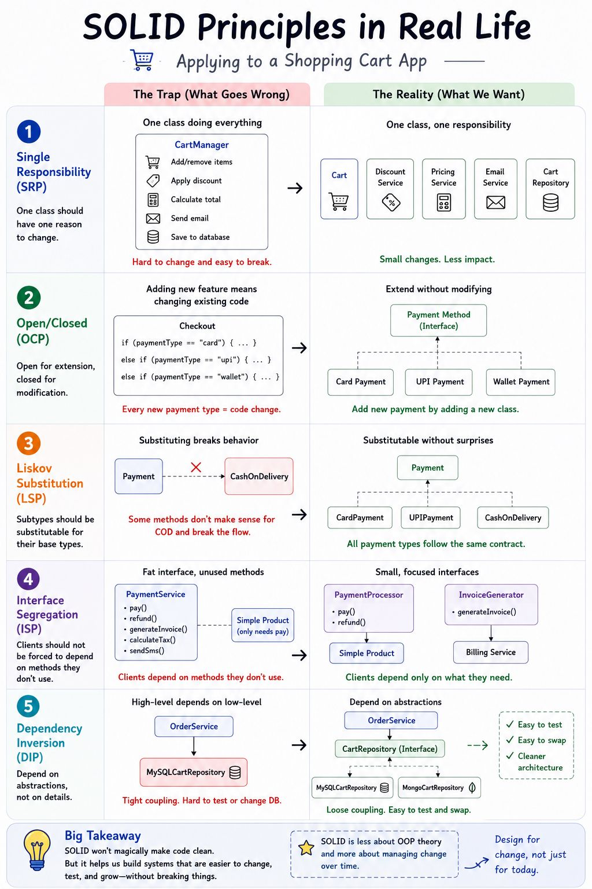
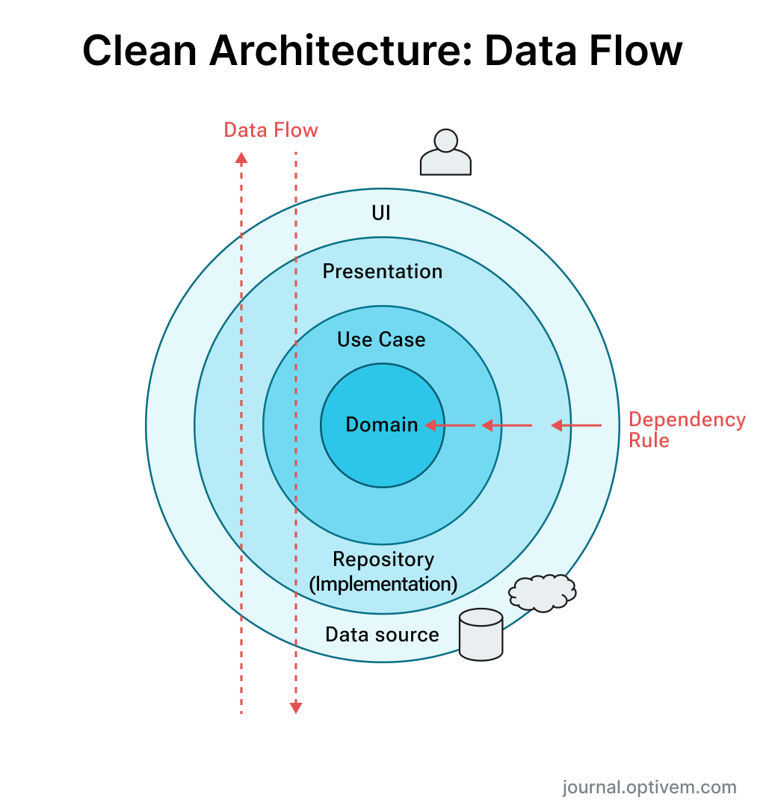
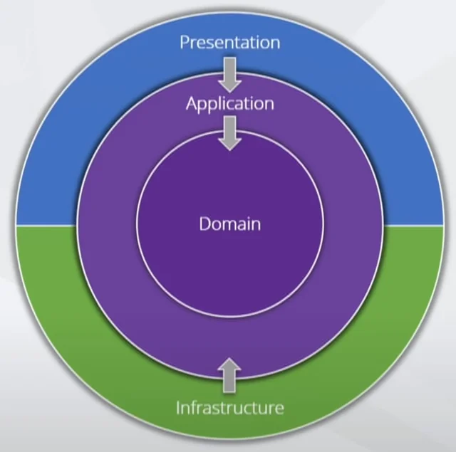
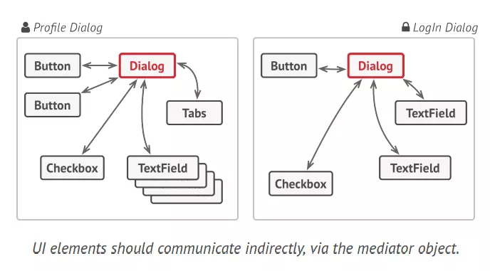
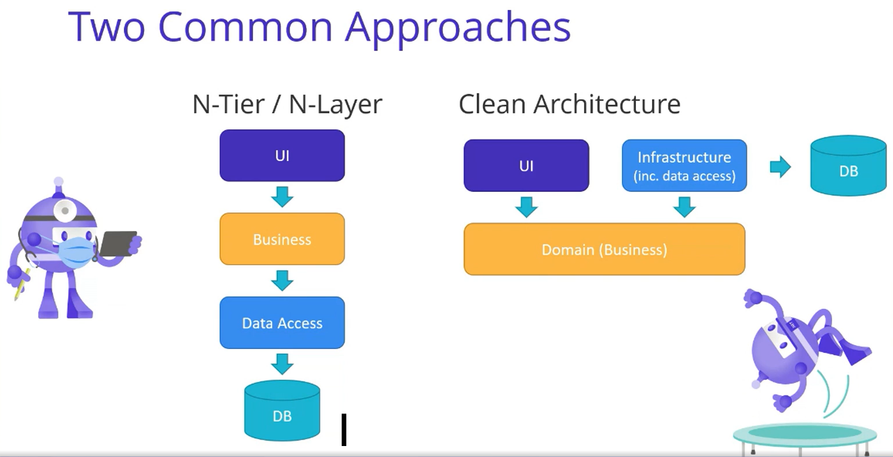

# Keyword: SOLID Principles, Clean Architecture, MediatR / Mediator Pattern

## 1. Khái niệm

### 1.1 SOLID Principles

- SOLID Principles là 5 nguyên tắc quan trọng trong lập trình và thiết kế hướng đối tượng (OOP - OOD).

<div align="center">
  
</div>

- 5 nguyên tắc này bao gồm:
  - S - Single Responsibility Principle (Nguyên tắc Đơn nhiệm).

  - O - Open/Closed Principle (Nguyên tắc Đóng/Mở).

  - L - Liskov Substitution Principle (Nguyên tắc Thay thế Liskov).

  - I - Interface Segregation Principle (Nguyên tắc Phân tách Giao diện).

  - D - Dependency Inversion Principle (Nguyên tắc Đảo ngược Phụ thuộc).

### 1.2 Clean Architecture

- Clean Architecture là một mô hình thiết kế phần mềm mà trong đó các ứng dụng được cấu trúc thành các layers, với mỗi layer tương ứng với một role nhất định.

- Clean Architecture chia code thành các layers để đảm bảo rằng: Business logic không phụ thuộc vào khung kiến trúc như thư viện sử dụng hoặc technology giúp cho Business layer linh hoạt và được tái sử dụng.

### 1.3 MediatR / Mediator Pattern

- Mediator Pattern là một trong những Pattern thuộc nhóm hành vi (Behavior Pattern). Mediator có nghĩa là người trung gian.

- Mediator sẽ làm giảm bớt sự phụ thuộc vào nhau của các component trong giao diện.

- Mediator hoạt động như một cầu nối giữa các component đó.

## 2. Mục đích sử dụng

### 2.1 SOLID Principles

- Dùng khi build các application lớn cần chia thành module nhỏ để các thành viên trong team dễ dàng làm việc.

- Giúp clean code hơn.

- Dễ dàng maintain và modify.

- Dễ dàng scale up lên sau này mà không bị rối code cũ.

### 2.2 Clean Architecture

- Mục tiêu của Clean Architecture là để xây dựng ứng dụng với khả năng linh hoạt cao, dễ dàng maintain, testing liên quan đến công nghệ và framework được sử dụng. Đảm bảo khi tác động tới database, điều chỉnh UI hay áp dụng một framework mới thì business logic vẫn không được đụng tới.

### 2.3 MediatR / Mediator Pattern

## 3. Thành phần chính

### 3.1 SOLID Principles

- 5 nguyên tắc này bao gồm:
  - S - Single Responsibility Principle (Nguyên tắc Đơn nhiệm): Nguyên tắc này chỉ rằng một class chỉ nên giữ một trách nhiệm duy nhất. Nếu đảm nhận quá nhiều việc nó có thể trở quá cồng kềnh, khi thay đổi tác vụ việc thay đổi class này có thể ảnh hưởng tới các chức năng khác.

  - O - Open/Closed Principle (Nguyên tắc Đóng/Mở): chúng ta có thể hoàn toàn cho phép việc mở rộng class này, nhưng không được thay đổi những chức năng (code) đã có.

  - L - Liskov Substitution Principle (Nguyên tắc Thay thế Liskov): các đối tượng của lớp con đều có thể thay thế hoàn toàn các đối tượng lớp cha mà vẫn giữ tính đúng đắn của nghiệp vụ. Lớp con không được làm trái hành vi mà lớp cha đã xây dựng. Các quy tắc cơ bản bao gồm:
    - Phải thừa kế từ lớp cha mà không làm thay đổi hành vi của đối tượng.
    - Các phương thức của lớp con phải tuân thủ hoặc mạnh hơn các phương thức của lớp cha.
    - Nếu thay object cha bằng object con thì chương trình vẫn hoạt động đúng.

  - I - Interface Segregation Principle (Nguyên tắc Phân tách Giao diện): có thể tách một các interface lớn thành các interface nhỏ cho từng class implement. Việc này đảm bảo các class chỉ cần thực thi các method trong interface nào cần thiết chứ không phải implement cả interface lớn nhưng có các method không dùng rồi là để trống khiến cho code bị dài và rối.

  - D - Dependency Inversion Principle (Nguyên tắc Đảo ngược Phụ thuộc): Các module cấp cao không nên phụ thuộc vào các module cấp thấp mà chúng nên phụ thuộc và abstraction.

### 3.2 Clean Architecture

- Clean Architecture tổ chức code thành các layers đảm bảo mỗi layer đảm nhận một nhiệm vụ riêng. Các layers chính bao gồm:
  1. Domain Layer
  - Chứa các Entity và Business Rules cốt lõi của hệ thống.
  - Không phụ thuộc vào bất kỳ layer nào khác.
  2. Application Layer
  - Chứa các Use Case của hệ thống.
  - Điều phối luồng xử lý nghiệp vụ.
  - Định nghĩa các Interface để làm việc với dữ liệu.
  3. Infrastructure Layer
  - Triển khai các Interface được định nghĩa trong Application Layer.
  - Làm việc với Database, File System, External API,...
  4. Presentation Layer
  - Là nơi tiếp nhận request từ người dùng.
  - Ví dụ: Web API Controller, MVC, Blazor,...

  <div align="center">
    
  </div>
  <div align="center">
    
  </div>

### 3.3 MediatR / Mediator Pattern

  <div align="center">
    
  </div>

- Các thành phần trong mô hình trên bao gồm:
  1. Component: Các thành phần trên giao diện
  2. Interface Mediator: Mediator trung gian để giao tiếp với các component.
  3. Concrete Mediator: Nơi giữ mối quan hệ giữa các component khác nhau

## 4. Cách hoạt động

### 4.1 SOLID Principles

- Khi xây dựng class, interface và dependency giữa các module, cần áp dụng 5 nguyên tắc SOLID để đảm bảo hệ thống dễ mở rộng, dễ bảo trì và dễ kiểm thử.

- Đây là một ví dụ khi áp dụng SOLID Principles.

 <div align="center">
    
 </div>

### 4.2 Clean Architecture

- Trong Clean Architecture, luồng request thường hoạt động theo trình tự:

  Presentation Layer -> Application Layer -> Infrastructure Layer -> Database
  1. Client gửi HTTP Request tới Controller.
  2. Controller gọi Use Case trong Application Layer.
  3. Application Layer thực hiện nghiệp vụ và sử dụng các Interface đã định nghĩa.
  4. Infrastructure Layer triển khai các Interface đó để truy cập Database hoặc các dịch vụ bên ngoài.
  5. Kết quả được trả ngược về Controller và gửi cho Client.

 <div align="center">
    
 </div>

- Nguyên tắc quan trọng nhất của Clean Architecture là Dependency Rule.Mọi sự phụ thuộc trong hệ thống phải hướng vào trong:

<div align="center">
    
 </div>

Presentation -> Application -> Domain
Infrastructure -> Application -> Domain

- Domain Layer không được phụ thuộc vào bất kỳ layer nào bên ngoài. Nhờ đó Business Logic được bảo vệ khỏi các thay đổi về Database, Framework hoặc UI.

### 4.3 MediatR / Mediator Pattern

- Các component khác sẽ không phụ thuộc vào nhau nữa mà chỉ phụ thuộc vào Mediator.

- Khi các component này nhận tương tác của client và gọi đến Mediator. Sau đó Mediator sẽ quyết định tiếp gọi component nào tiếp theo.

- Hình ảnh minh hoạt của việc trước và sau khi áp dụng Mediator:

 <div align="center">
    
 </div>

## 5. Demo

- Trước khi áp dụng SOLID:

```C#
public class Student
{
    public void SaveToDatabase()
    {
    }

    public void GenerateReport()
    {
    }
}
```

- Sau khi áp dụng SOLID

```C#
public class Student
{
}

public class StudentRepository
{
    public void Save()
    {
    }
}

public class StudentReportService
{
    public void Generate()
    {
    }
}
```

## 6. Ưu điểm

### 6.1 SOLID Principles

- Đơn giản hóa mã nguồn, tạo ra mã nguồn dễ đọc, dễ hiểu và dễ bảo trì.

- Có thể tái sử dụng khi chia ra thành các module nhỏ.

- Dễ maintain và modify.

### 6.2 Clean Architecture

- Tách biệt lớp Business Layer trong clean architecture ra khỏi các layers khác như Domain, Application, Infrastructure layer. Tiện hơn so với kiến trúc mô hình 3 lớp - luồng sẽ hoạt động tuần tự. Controller (Presentation) gọi một Service (BLL). Service (BLL) trực tiếp sử dụng một DbContext hoặc Repository được cài đặt bằng EF Core (DAL). Lúc này, BLL phụ thuộc vào DAL và thậm chí là framework DAL (EF Core). Sự phụ thuộc này làm cho BLL khó kiểm thử một cách độc lập (Unit Test) vì nó gắn chặt với cơ sở dữ liệu thật hoặc mock thủ công phức tạp. Thay đổi DAL (ví dụ: chuyển từ SQL Server sang PostgreSQL hoặc NoSQL) sẽ ảnh hưởng lớn đến BLL. Thay đổi framework web cũng có thể lan tỏa sâu vào logic nghiệp vụ.

- Clean Architecture giải quyết vấn đề này bằng cách đảo ngược hướng phụ thuộc. Lớp Application (tương ứng với BLL) không phụ thuộc vào Infrastructure (tương ứng với DAL). Thay vào đó, lớp Application định nghĩa các Interface (ví dụ: IRepository, IApplicationDbContext). Lớp Infrastructure cài đặt các Interface đó. Nhờ Dependency Injection, Presentation layer (Composition Root) có thể kết nối các cài đặt cụ thể từ Infrastructure với các Interface ở Application, cho phép Application layer thực thi logic nghiệp vụ mà không cần biết chi tiết về cách dữ liệu được lưu trữ hay lấy ra.

 <div align="center">
    
 </div>

### 6.3 MediatR / Mediator Pattern

- Đảm bảo nguyên tắc Single Responsibility Principle (SRP): chúng ta có thể trích xuất sự liên lạc giữa các component khác nhau vào trong một nơi duy nhất, làm cho nó được bảo trì dễ dàng hơn.

- Đảm bảo nguyên tắc Open/Closed Principle (OCP): chúng ta có thể tạo ra các mediator mới mà không cần thay đổi các component.

- Giảm thiểu việc gắn kết giữa các component khác nhau trong một chương trình.

- Tái sử dụng các component đơn giản hơn.

## 7. Nhược điểm

### 7.1 SOLID Principles

- Khó trong việc lập trình khi phải chia nhỏ module và tuân thủ 5 nguyên tắc của SOLID principles.

- Khó thiết kế trong lúc đầu khi build dự án.

### 7.2 Clean Architecture

- Độ phức tạp cao, đặc biệt trong bước đầu xây dựng hệ thống.

- Các lớp và trừu tượng bổ sung có thể gây ra sự chậm trễ hoặc giảm hiệu suất cho ứng dụng, đặc biệt trong các ứng dụng yêu cầu hiệu suất cao.

### 7.3 MediatR / Mediator Pattern

- Nếu sử dụng về lâu thì có thể tạo thành "God Object" khi đối tượng Mediator phải đảm đương quá nhiều công việc. Nếu thiết kế không tốt sẽ lớp trung gian này sẽ thành điểm yếu của kiến trúc.

## 8. Kiến thức học được

- Em đã nắm được thế nào là SOLID principles và các nguyên tắc của SOLID principles.

- Hiểu được cách Clean Architecture tách biệt Business Logic khỏi Database và UI thông qua các abstraction (Interface). Do Application Layer định nghĩa các Interface, còn Infrastructure Layer triển khai các Interface đó. Và nhờ vào Dependency Injection, Application Layer có thể sử dụng dữ liệu mà không phụ thuộc trực tiếp vào Database hay Framework cụ thể.

.....

## 9. Khó khăn gặp phải

- Ban đầu em gặp khó khăn trong việc hiểu hướng phụ thuộc (Dependency Direction) của Clean Architecture. Em nhầm rằng Presentation Layer có thể làm việc trực tiếp với Infrastructure Layer. Sau khi tìm hiểu thêm tài liệu và xem các ví dụ thực tế, em hiểu rằng request vẫn đi qua Application Layer để xử lý nghiệp vụ. Infrastructure Layer chỉ đóng vai trò triển khai các Interface được định nghĩa bởi Application Layer. Nhờ đó Business Logic không phụ thuộc trực tiếp vào Database hay các công nghệ cụ thể.

- Em cũng có hơi confuse về cách hoạt động của Mediator. Sau khi làm demo thử thì em mới hiểu rõ hơn cách nó setup và luồng chạy như nào.
