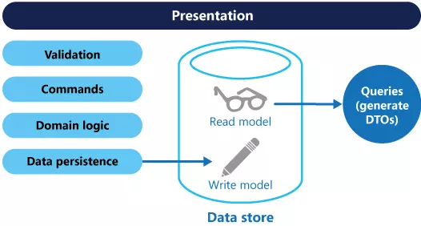
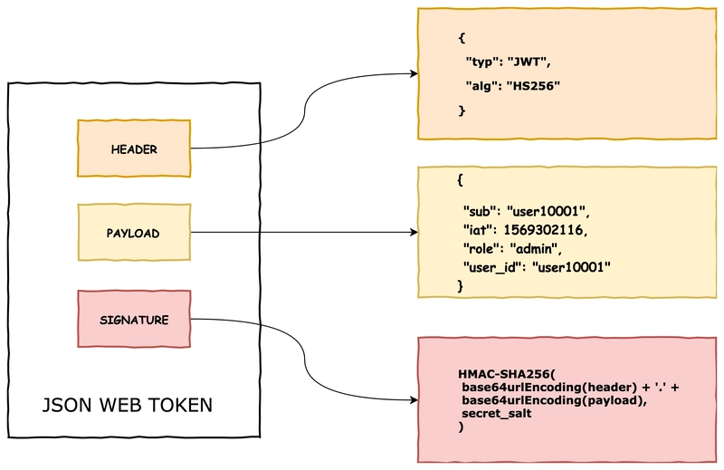
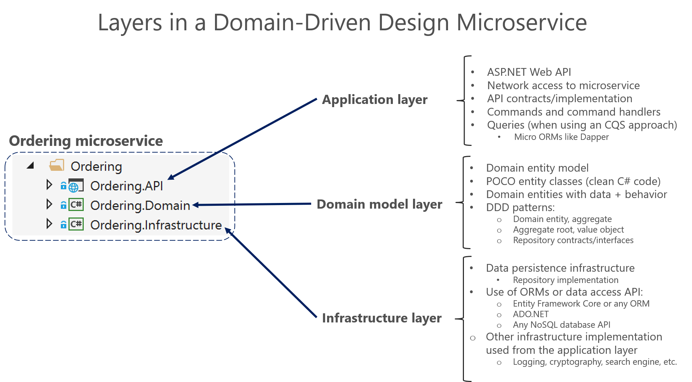
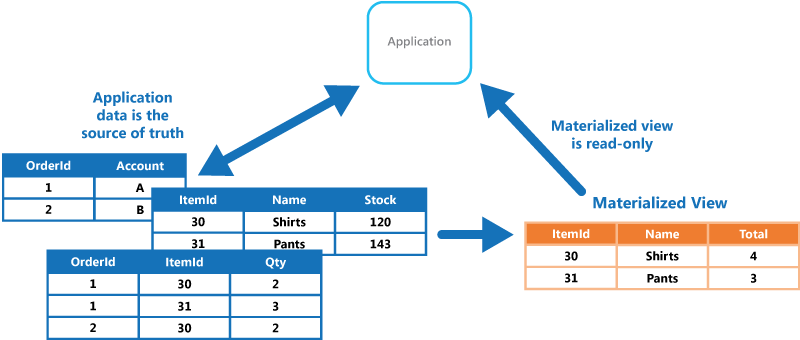
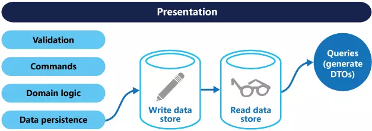
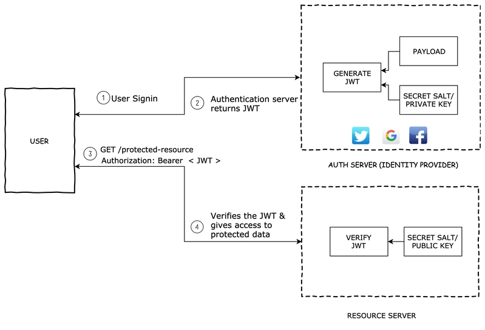
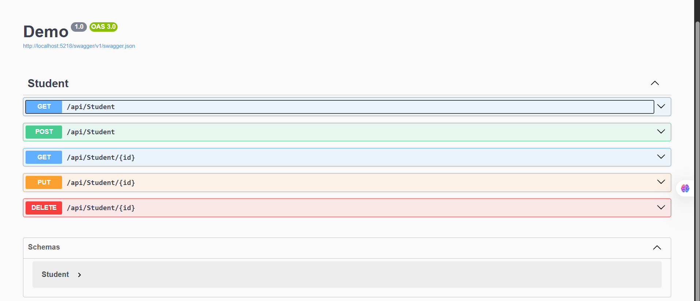

# Keyword: DDD (Domain Driven Design), CQRS Pattern, JWT Authentication

## 1. Khái niệm

### 1.1 DDD (Domain Driven Design)

- DDD (Domain Driven Design) là một cách tiếp cận trong việc thiết kế phần mềm mà ở đó ta đặt business domain vào trung tâm của hệ thống. Có nghĩa chúng ta cấu trúc project, model, interface sao cho những domain logic không được phụ thuộc và framework và infrastructure.

- Nó đề xuất mô hình hóa phần mềm dựa trên các quy tắc nghiệp vụ thực tế, sử dụng quy tắc nghiệp vụ chung (Ubiquitous Language) giữa các nhà phát triển và chuyên gia.

### 1.2 CQRS Pattern

- CQRS Pattern là một giải pháp chia tách tác vụ đọc và cập nhật thành các model khác nhau, sử dụng command để cập nhật và query để đọc dữ liệu.

### 1.3. JWT Authentication

- JWT là một chuẩn định dạng token dùng để trao đổi thông tin giữa các bên dưới dạng JSON được ký số nhằm đảm bảo tính toàn vẹn của dữ liệu.

- JWT không mã hóa dữ liệu. Nội dung trong Payload có thể được đọc bởi bất kỳ ai sở hữu token. Tuy nhiên chữ ký số (Signature) giúp đảm bảo dữ liệu không bị chỉnh sửa trái phép.

## 2. Mục đích sử dụng

### 2.1 DDD (Domain Driven Design)

- Xây dựng ứng dựng mà ở đó domain business không bị tác động bởi Framework hay infrastructure.

### 2.2 CQRS Pattern

- Mục tiêu CQRS Pattern là chia 2 tác vụ đọc và cập nhật dữ liệu thành 2 luồng khác nhau để giảm độ phức tạp của nghiệp vụ và cho phép tối ưu riêng từng luồng xử lý. Nếu vẫn sử dụng CRUD thì đối với các ứng dụng phức tạp thì câu truy vấn cũng sẽ trở nên phức tạp tương tự với việc cập nhật nên khi không tách ra thì đọc / cập nhật quá lâu sẽ gây ra lock DB và không thực hiện được các tác vụ tiếp theo.

- Trong các hệ thống lớn, CQRS có thể sử dụng hai data store riêng cho đọc và ghi để tối ưu hiệu năng, tuy nhiên điều này không phải yêu cầu bắt buộc của CQRS.Khi tách thành 2 data store giúp ứng dụng có thể 2 cho các models có thể được tách biệt, cô lập với nhau, tránh lock DB.

### 2.3. JWT Authentication

- Để xác định chính chủ thông qua bearer token.

- Có thể dùng xác thực APIs.

## 3. Thành phần chính

### 3.1 DDD (Domain Driven Design)

- Một vài khái niệm cốt lõi:
  - Bounded Context: nơi phân biệt các domain model.
  - Entities: các domain object như student, customer,..
  - Value Objects: giá trị của đối tượng được xác định bởi các thuộc tính của object đó.
  - Aggregates and Aggregate Root: các cụm entities/value objects có cùng tính nhất quán. Chỉ có root mới được truy cập từ bên ngoài.
  - Repositories: là abstraction dùng để truy xuất và lưu trữ Aggregate Root.
  - Domain Events: thông báo sự kiện quan trọng diễn ra trong domain.

### 3.2 CQRS Pattern

- Command nên được dựa trên task thay vì tập trung vào dữ liệu.

- Command có thể đặt trong một queue cho xử lý bất đồng bộ (asynchronous) thay vì được xử lý đồng bộ (synchronous).

- Query không bao giờ sửa đổi dữ liệu của cơ sở dữ liệu. Một query trả về một DTO mà không gói gọn trong bất kì hiểu biết của domain nào.

<div align="center">
    
</div>

### 3.3. JWT Authentication

- Cấu trúc JWT gồm 3 phần:
  - Header: chứa thông tin như loại token (token type) và thuật toán được sử dụng để mã hóa và ký tên. Các thuật toán có thể là HMAC, SHA256, RSA, HS256, RS256.

  ```json
  {
    "alg": "HS256",
    "typ": "JWT"
  }
  ```

  - Payload: chứa session data được gọi là các claims. Các claims tiêu chuẩn thường được dùng là
    - Issuer(iss)
    - Subject (sub)
    - Audience (aud)
    - Expiration time (exp)
    - Issued at (iat)

  ```json
  {
    "sub": "1234567890",
    "name": "John Doe",
    "admin": true
  }
  ```

  - Signature: đây là phần quan trọng của JWT, nó thường được tính toán bởi bộ mã hóa của header và payload chuyển thành base64url.

  ```json
  HMACSHA256(
  base64UrlEncode(header) + "." +
  base64UrlEncode(payload),
  secret)
  ```

<div align="center">
    
</div>

## 4. Cách hoạt động

### 4.1 DDD (Domain Driven Design)

- Map qua .NET project thì ta có:
  - User Interface Layer: làm nhiệm vụ biểu diễn thông tin trực quan cho user và dịch các user command. Tức là khi nhấn nút trên các UI input control là các sự kiện sẽ được dịch thành các command xử lý ở các tầng dưới.

  - Application Layer: Tầng này được thiết kế với ít logic xử lý chỉ để làm nhiệm vụ coordinate các Activity của Application và không chứa Business Logic, nó không chứa state của các Business Object mà chỉ chứa state của Application Task Progress. Phần này chỉ làm nhiệm vụ forward các task đến nơi cần xử lý.

  - Domain Layer: Đây là trái tim của ứng dụng (Business Software), các state của Business Object đều nằm ở đây. Việc lưu trữ các Business Object và các state của nó được chuyển giao cho tầng Infrastructure ở dưới. Các nghiệp vụ sẽ được mô tả tại Domain Layer, và cấu trúc source code cũng được tổ chức theo tên các nghiệp vụ chứ không để kiểu view, controller như truyền thống.

  - Infrastructure Layer: Đóng vai trò cung cấp thư viện cho các tầng khác. Nó cung cấp cơ chế giao tiếp giữa các Layer với nhau, cũng như cung cấp các chức năng khác như lưu trữ các Business Object của tầng Domain.

 <div align="center">
    
 </div>

### 4.2 CQRS Pattern

- CQRS Pattern là chia 2 tác vụ đọc và cập nhật dữ liệu thành 2 luồng khác nhau, khi các model sẽ được chạy tách biệt và không liên quan tới nha. Để cô lập tốt hơn, có thể chia tách dữ liệu đọc và dữ liệu ghi. Cơ sở dữ liệu đọc có thể sử dụng schema dữ liệu của riêng nó để tối ưu cho việc query. Cho ví dụ, nó có thể lưu trữ dạng Materialized View của dữ liệu, ngoài ra để tránh join và mapping phức tạp. Nó thậm chí còn có thể sử dụng một kiểu lưu trữ dữ liệu khác.

  <div align="center">
    
  </div>

- Nếu tách thành 2 data store cho tác vụ đọc và cập nhật thì chúng cần phải giữ đồng bộ với nhau.
  <div align="center">
    
  </div>

### 4.3. JWT Authentication

- Ban đầu các Identity Provider như Google, Facebook sẽ tạo ra JWT để xác định tính chính chủ của user và token sẽ được decode và verify thông qua secret salt / public key.

 <div align="center">
     
  </div>

- Cách thức hoạt động như sau:
  1. User đăng nhập bằng username + password hoặc bằng google, facebook.
  2. Authentication Server xác thực thông tin đăng nhập. Authentication Server tạo JWT. JWT gửi về Client
  3. Client gửi JWT trong Authorization Header..
  4. Resource Server kiểm tra Signature

## 5. Demo

5. Demo

- Em đã áp dụng lại demo ASP.NET Core Web API của ngày trước để thử nghiệm CQRS Pattern.

- Thay vì xử lý toàn bộ các tác vụ trong cùng một Service hoặc Controller, em tách riêng thành hai luồng:
  - Queries: chỉ thực hiện các thao tác đọc dữ liệu (Get Student, Get All Students,...).

  - Commands: chỉ thực hiện các thao tác thay đổi dữ liệu (Create Student, Update Student, Delete Student,...).

- Controller không trực tiếp xử lý nghiệp vụ mà chỉ tiếp nhận HTTP Request và gọi Command hoặc Query tương ứng.

Ví dụ:

GET /api/Student
-> GetStudentsQuery

POST /api/Student
-> CreateStudentCommand

<div align="center">
     
  </div>

- Qua demo này em thấy việc tách biệt giữa đọc và ghi giúp source code rõ ràng hơn, dễ bảo trì hơn và là nền tảng để mở rộng thành CQRS hoàn chỉnh với MediatR hoặc các kiến trúc lớn hơn trong tương lai.

## 6. Ưu điểm

### 6.1 DDD (Domain Driven Design)

- Giúp xây dựng các ứng dụng có nhiều nghiệp vụ phức tạp hoặc thay đổi nghiệp vụ.

### 6.2 CQRS Pattern

- Tạo tính đọc lặp giữa các tác vụ ghi và đọc, giảm tỉ lệ tranh chấp.

- Bảo mật tốt hơn khi các domain entities có quyền hạn mới được cập nhật data.

- Giúp dễ maintain và modify.

- Hiệu suất cao hơn.

### 6.3. JWT Authentication

- JWT sẽ ngắn gọn hơn so với SAML (Security Assertion Markup Language Tokens). Do đó khi encode ra thì kích thước nó sẽ nhỏ hơn và thuận lợi khi truyền vào môi trường HTML, HTTP.

## 7. Nhược điểm

### 7.1 DDD (Domain Driven Design)

- Khó thiết kế trong lúc đầu khi build dự án.

- Áp dụng cho các ứng dụng nhỏ thì tốn kém mà không cần thiết.

### 7.2 CQRS Pattern

- Độ phức tạp cao, đặc biệt trong bước đầu xây dựng hệ thống, đặc biệt khi chúng sử dụng cùng pattern Event Sourcing.

- Các lớp và trừu tượng bổ sung có thể gây ra sự chậm trễ hoặc giảm hiệu suất cho ứng dụng, đặc biệt trong các ứng dụng yêu cầu hiệu suất cao.

- Phải đảm bảo được sự thống nhất, khi chia làm 2 data store lưu trữ model bên đọc phải được cập nhật để phản ánh các thay đổi của lưu trữ model bên ghi.

### 7.3. JWT Authentication

- Bảo mật, nếu bạn bị lộ hay mất bearer token vào tay người khác họ sẽ có thể truy cập vào và lấy dữ liệu của bạn.

## 8. Kiến thức học được

- Em đã hiểu được tư tưởng Domain Driven Design khi đặt Business Domain làm trung tâm của hệ thống.

- Hiểu được cách CQRS tách biệt luồng đọc và ghi dữ liệu nhằm giảm độ phức tạp của nghiệp vụ và tăng khả năng mở rộng hệ thống.

- Nắm được cấu trúc JWT gồm Header, Payload và Signature cũng như cách JWT được sử dụng trong quá trình xác thực và phân quyền API.

- Ứng dụng được CQRS pattern vào ứng dụng với Demo Web API cũng khi chia làm 2 luồng Queries và Commands.

## 9. Khó khăn gặp phải

- Ban đầu em hơi khó khăn khi tìm hiểu DDD và ứng dụng với project như nào do có nhiều định nghĩa mới. Sau em có đọc lại kiến trúc cũng như website để hiểu hơn.
