# Keyword: RabbitMQ, gRPC, API Gateway, Microservice

## 1. Khái niệm

### 1.1 RabbitMQ

- RabbitMQ là một trạm trung chuyển message giữa các hệ thống với nhau.Nó là một Message Broker mã nguồn mở triển khai giao thức AMQP (Advanced Message Queuing Protocol), cho phép các hệ thống giao tiếp với nhau thông qua cơ chế gửi và nhận message bất đồng bộ.

- Nó là một nơi các queue được định nghĩa, phục vụ cho ứng dụng với mục đích vận chuyển một hoặc nhiều message.

### 1.2 gRPC

- gRPC là một framework open-source hỗ trợ giao tiếp giữa các service theo mô hình RPC (Remote Procedure Call) thông qua HTTP/2 và Protocol Buffers.

- gRPC cung cấp một hiện thực mới cho RPC bằng cách làm cho nó có thể tương thích, hiện đại và hiệu quả nhờ sử dụng các công nghệ như Protocol buffers và HTTP/2.

### 1.3 API Gateway

- API Gateway tiếp nhận request từ client, thực hiện các chức năng như Authentication, Authorization, Rate Limiting, Logging, Caching và Routing trước khi chuyển request tới service phù hợp.

- Có nghĩa nó là một cổng trung gian tiếp nhận request từ clients sau đó nó sẽ chỉnh sửa, xác thực và điều hướng request tới các service cụ thể.

### 1.4 Microservice

- Microservice mô tả một quy trình xây dựng một ứng dụng phân tán từ nhiều service có thể triển khai một cách riêng lẻ.

- Nó là một phương pháp xây dựng phần mềm mà ở đó ứng dụng được chia nhỏ thành các phần nhỏ hơn, từng service hay module cụ thể và độc lập với nhau.

## 2. Mục đích sử dụng

### 2.1 RabbitMQ

- Tạo kết nối giữa các hệ thống với nhau thông qua các producers và consumers.

- Điều phối các messages của ứng dụng.

### 2.2 gRPC

- Cung cấp phương thức liên lạc với các service tiện lợi và hiệu suất hơn thông qua RPC API áp dụng HTTP2 và Protocol Buffer.

### 2.3 API Gateway

- Tiếp nhận và điều hướng requests.

- Bảo mật API và phân tích số lượng requests.

### 2.4 Microservice

- Chia ứng dụng thành các phần nhỏ độc lập, dễ quản lí, thường áp dụng cho các dự án có nhiều team có thể chia ra mỗi team xây dựng một phần microservices.

## 3. Thành phần chính

### 3.1 RabbitMQ

- Producer: Ứng dụng gửi message.

- Consumer: Ứng dụng nhận message.

- Message: Thông tin truyền từ Producer đến Consumer qua RabbitMQ.

- Queue: Nơi để lưu trữ messages.

- Connection: Một kết nối TCP giữa ứng dụng và RabbitMQ broker.

- Channel: Một kết nối ảo trong một Connection. Việc publishing hoặc consuming từ một queue đều được thực hiện trên channel.

- Exchange: Là nơi nhận message được publish từ Producer và đẩy chúng vào queue dựa vào quy tắc của từng loại Exchange. Các loại Exchange bao gồm:
  - Direct Exchange: vận chuyển message đến queue dựa vào routing key, thường được sử dụng cho việc định tuyến tin nhắn unicast-đơn hướng.

  <div align="center">
    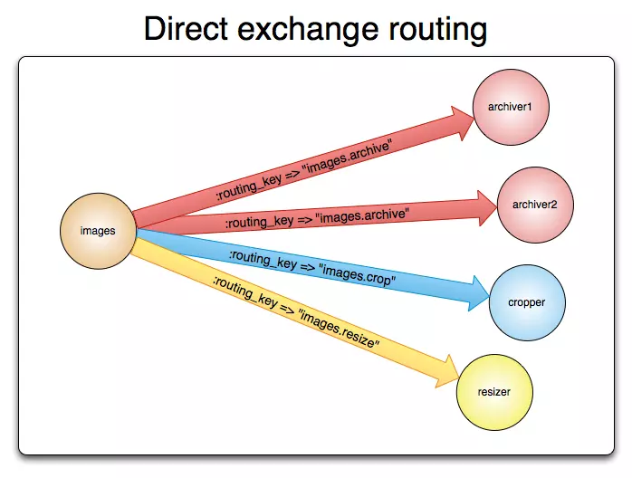
  </div>
  - Default Exchange: bản chất là một Direct Exchange nhưng không có tên, mọi queue được tạo sẽ tự động được liên kết với nó bằng một routing key giống như tên queue.
  - Fanout Exchange: Fanout exchange định tuyến message tới tất cả queue mà nó bao quanh, routing key bị bỏ qua. Giả sử, nếu nó N queue được bao quanh bởi một Fanout exchange, khi một message mới published, exchange sẽ vận chuyển message đó tới tất cả N queues.
  <div align="center">
    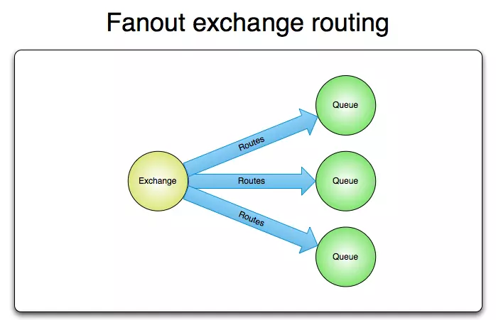
  </div>
  - Topic Exchange: định tuyến message tới một hoặc nhiều queue dựa trên sự trùng khớp giữa routing key và pattern. Topic exchange thường sử dụng để thực hiện định tuyến thông điệp multicast.
  - Header Exchange: bỏ đi routing key mà thay vào đó định tuyến dựa trên header của message.

- Binding: Đảm nhận nhiệm vụ liên kết giữa Exchange và Queue.

- Routing key: Một key mà Exchange dựa vào đó để quyết định cách để định tuyến message đến queue. Có thể hiểu Routing key là địa chỉ dành cho message.

### 3.2 gRPC

<div align="center">
    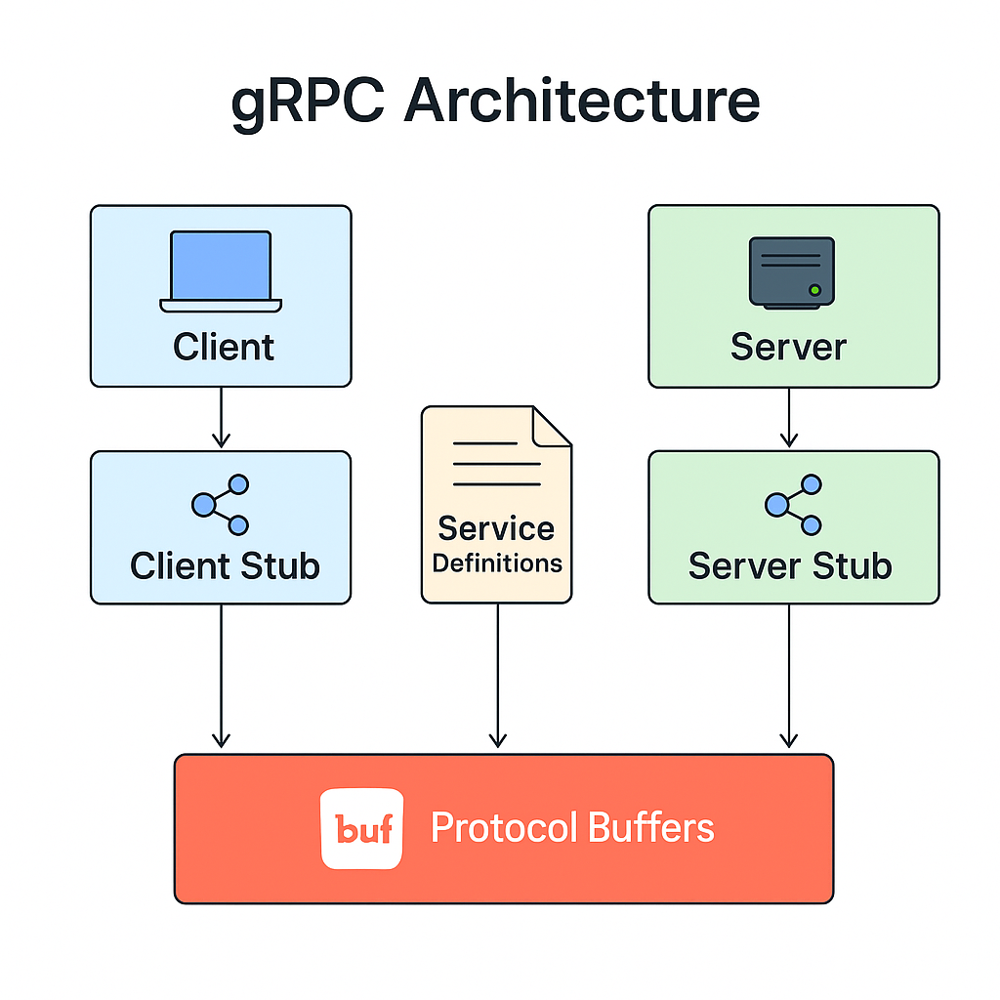
</div>

- File .proto: là nơi định nghĩa dữ liệu cần truyền là gì như Service nào, hàm nào, input-output là gì.

- Server gRPC: là phía cung cấp dịch vụ, Server nhận yêu cầu từ client, xử lý, rồi trả kết quả về.

- Client gRPC: là phía gọi dịch vụ, client sẽ gọi các hàm từ xa giống như gọi hàm bình thường trong code.

- Protocol Buffers: Đây là cách gRPC đóng gói dữ liệu. Khi sử dụng protocol buffers, code có thể generate tự động class và method theo ngôn ngữ. Dữ liệu trong protocol buffer ở dạng binary, kích thước dữ liệu sẽ nhỏ hơn nhiều so với dạng json hay xml.

### 3.3 API Gateway

<div align="center">
    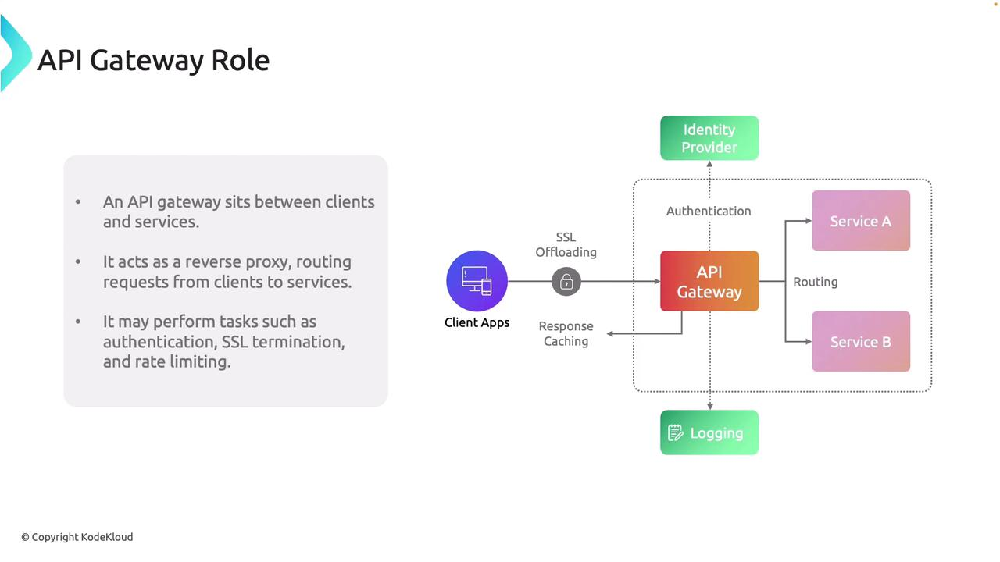
</div>

- Clients App: Ứng dụng gửi requests

- API Gateway: nơi tiếp nhận, xử lý và điều hướng requests.

- Identity Providers: Các nhà cung cấp dịch vụ như Facebook, Google.

- Services: nơi thực thi các requests sau khi nhận được từ API Getway.

### 3.4 Microservice

<div align="center">
    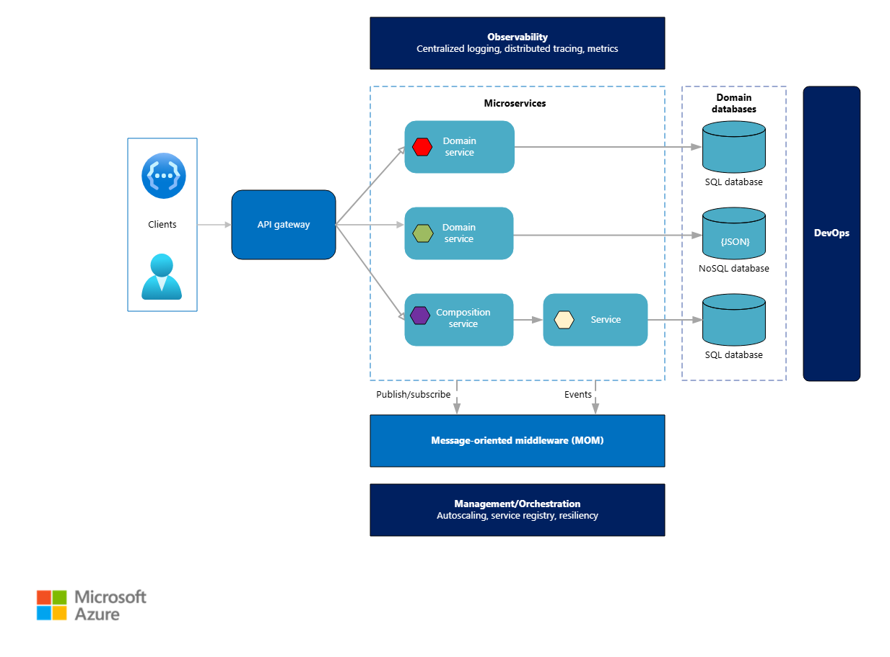
</div>

- Management/Orchestration: thành phần này có nhiệm vụ quản lí việc điều phối các microservices. Nó lên lịch và triển khai các services thông qua các nodes, xác định và sửa lỗi.

- API gateway: nơi tiếp nhận, xử lí và điều hướng các request tới các services phù hợp.

- Message-oriented middleware: nền tảng cho phép các microservices tương tác bất đồng bộ, cho phép các services giải quyết các requests một cách độc lập. Cách tiếp cận này cho phép service phản ứng với các sự kiện real-time và giao tiếp thông qua asynchronous messaging.

- Observability: là nơi giúp duy trì độ tin cậy của hộ thống và giải quyết sự cố nhanh chống dựa vào centralized logging tập trung các log lại giúp debug dễ hơn. Distributed tracing theo dõi các request thông qua service boundary.

- Data management: Kiến trúc Microservices thường sử dụng nhiều loại ngôn ngữ lưu trữ database khác nhau như SQL or NoSQL, dựa vào từng yêu cầu của các services mà chọn loại database khác nhau. Cách tiếp cận này phù hợp với DDD với ý tưởng chia thành các context riêng biệt.

## 4. Cách hoạt động

### 4.1 RabbitMQ

<div align="center">
    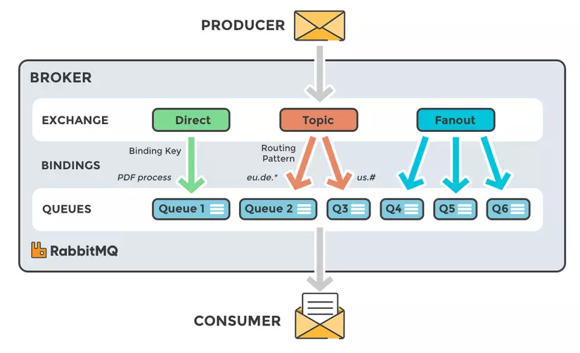
</div>

- Producer gửi Message tới Exchange.

- Exchange sẽ đánh giá Message dựa vào binding rules để định tuyến Message vào 1 queue hay nhiều queue. Mỗi loại exchange sẽ cho 1 binding rules khác nhau.

- Sau khi được định tuyến, Message sẽ được lưu trữ trong queue.

- Consumer đăng ký nhận Message từ Queue. RabbitMQ sẽ chủ động đẩy Message tới Consumer khi có dữ liệu mới.

### 4.2 gRPC

  <div align="center">
    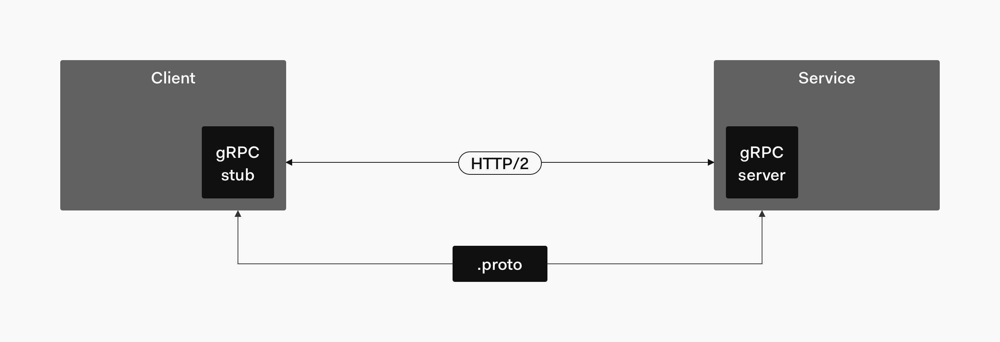
  </div>

- Client gửi request.

- Request được chuyển thành dữ liệu nhị phân nhỏ gọn.

- Dữ liệu đi qua HTTP/2.

- Server nhận request và xử lý.

- Server trả response về client.

### 4.3 API Gateway

 <div align="center">
     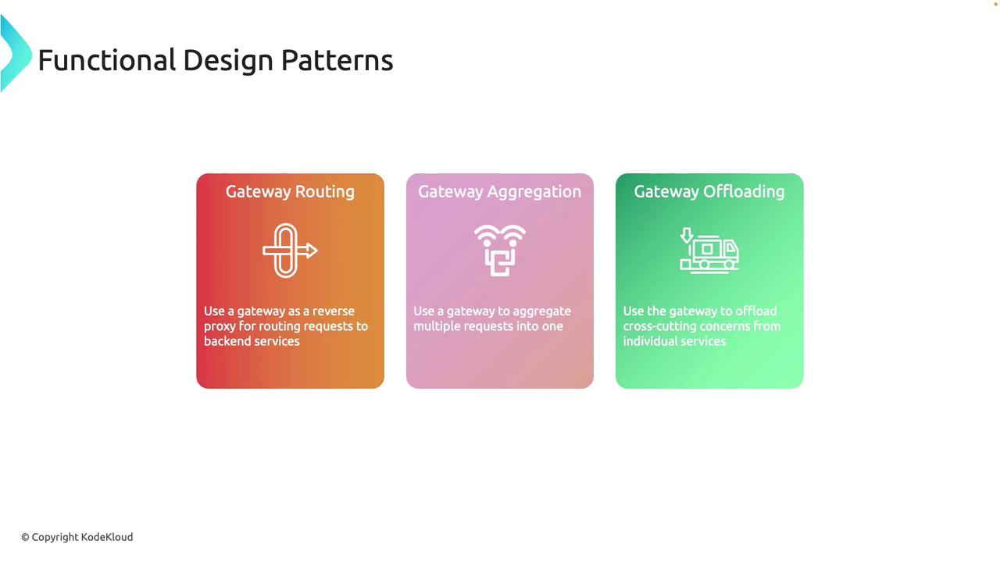
  </div>

- Gateway Routing: Đóng vai trò như một nơi điều tiết và định hướng requests tới đúng backend service.

- Gateway Aggregation: Nó sẽ tổng hợp từ nhiều lời backend service calls thành một client request, giảm số lượng call cần thiết và đơn giản logic.

- Gateway Offloading: giải quyết được các vấn đề như Authentication, Logging và SSL termination; giảm gánh nặng cho từng service.

### 4.4 Microservice

- Microservices hoạt động bằng cách chia một ứng dụng lớn thành các dịch vụ nhỏ, độc lập. Mỗi dịch vụ đảm nhận một chức năng duy nhất (ví dụ: thanh toán, quản lý người dùng), sở hữu cơ sở dữ liệu riêng và giao tiếp với nhau qua mạng bằng các giao thức nhẹ như HTTP/REST hoặc Message Broker.

 <div align="center">
     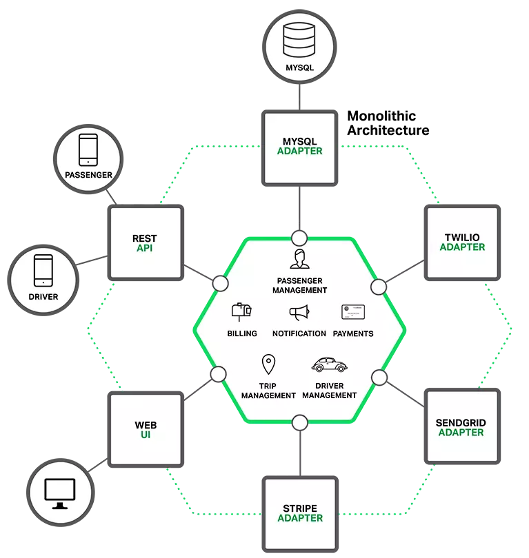
  </div>

- Các service hoạt động độc lập có business logic riêng, quản lí database riêng và giao tiếp với nhau thông qua API

 <div align="center">
     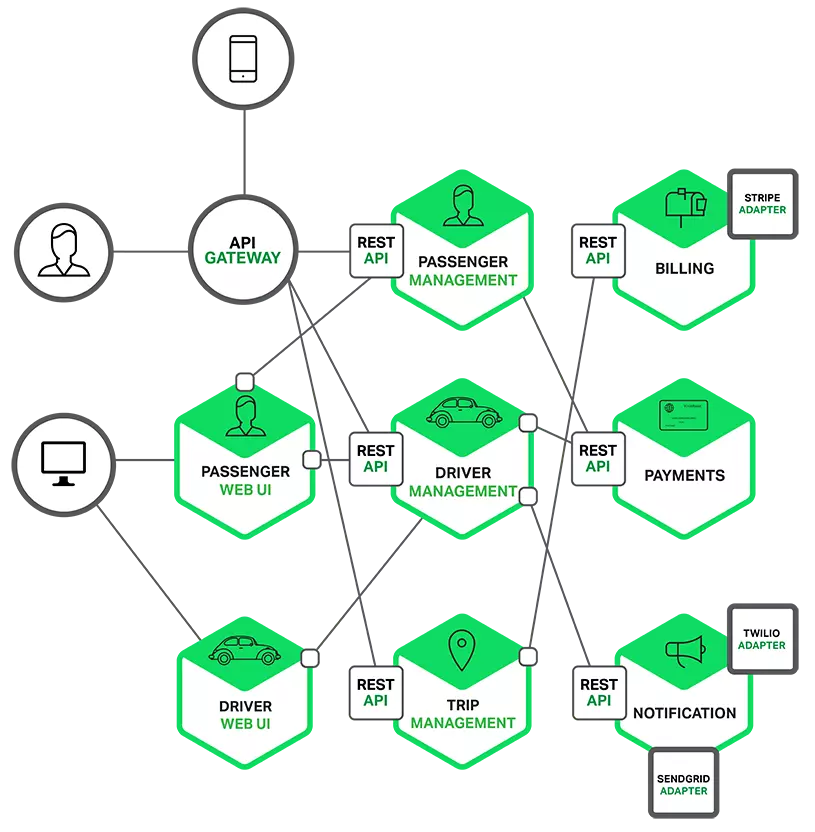
  </div>

## 5. Demo

- Em sẽ sử dụng lại ứng dụng DemoWebAPI quản lý học sinh để mô phỏng vai trò của API Gateway.

```
Client -> API Gateway -> Student API -> Database
```

- Luồng hoạt động như sau:
  1. Người dùng mở giao diện quản lí học sinh
  2. Client gửi request

  ```http
  GET /api/students
  ```

  3. API Gateway tiếp nhận request và định tuyến tới Student Service.

  ```
  Gateway Route -> http://localhost:5218/api/Student
  ```

  4. Student API xử lý request tại endpoint:

  ```C#
    [HttpGet]
    public IActionResult GetAllStudents()
    {
        var students = _studentQueries?.GetAllStudents();
        return Ok(students);
    }
  ```

  5. Student API truy vấn dữ liệu từ Database và trả về kết quả:
   <div align="center">
     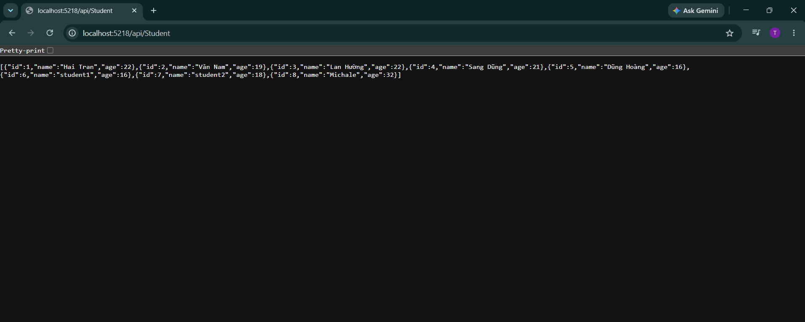
  </div>

## 6. Ưu điểm

### 6.1 RabbitMQ

- Định tuyến Message một cách linh hoạt dựa vào nhiều loại Exchange khác nhau.

### 6.2 gRPC

- Truyền dữ liệu dưới dạng binary.

- Gửi được nhiều request nhờ vào HTTP/2.

- gRPC cho hiệu suất tốt hơn.

- Phổ biến với nhiều ngôn ngữ khác nhau.

- gRPC có khả năng sinh tự động Client Stub và Server Stub từ file .proto, giúp giảm đáng kể lượng code phải viết thủ công.

### 6.3 API Gateway

- Không bị lộ nghiệp vụ của microservice khi các requests đều đi qua API Getway.

- Dễ dàng theo dõi và quản lí traffic.

- Thêm một lớp bảo mật cho hệ thống.

### 6.4 Microservice

- Dễ nâng cấp và scale up, scale down.

- Do tách biệt nên nếu một service bị lỗi, toàn bộ hệ thống vẫn hoạt động bình thường.

- Các service nằm tách biệt nhau, chúng có thể được sử dụng các ngôn ngữ lập trình riêng, database riêng.

## 7. Nhược điểm

### 7.1 RabbitMQ

- Khó khăn trong việc thiết lặp.

- Khi quá nhiều queue cũng như binding quá nhiều sẽ làm tăng bộ nhớ.

### 7.2 gRPC

- Do truyền dữ liệu dưới dạng binary nên cần có công cụ để debug.

### 7.3 API Gateway

- Chắc chắn tăng thời gian response do phải qua lớp trung gian để xử lý và điều hướng requests.

- Nếu không config hợp lý, khi lượng requests quá nhiều sẽ gây nghẽn tại API Getway và làm chậm hệ thống.

### 7.4 Microservice

- Việc đảm bảo tính đồng nhất trong dữ liệu sẽ trở nên phức tạp hơn
- Sử dụng nhiều service nên việc theo dõi, quản lý các service này sẽ phức tạp hơn

## 8. Kiến thức học được

- Em đã phân biệt được vai trò của RabbitMQ và API Gateway trong hệ thống Microservices.

- Em hiểu được nên sử dụng giao tiếp đồng bộ (REST/gRPC) khi client cần phản hồi ngay để tiếp tục luồng xử lý, độ trễ thấp và sử dụng giao tiếp bất đồng bộ thông qua Message Broker khi ta phân tách hệ thống.

- Em nắm được cách các service trong kiến trúc Microservices có thể giao tiếp với nhau bằng REST API, gRPC hoặc RabbitMQ tùy theo yêu cầu của hệ thống.

## 9. Khó khăn gặp phải

- Ban đầu em gặp khó trong việc hiểu concept của RabbitMQ và API Gateway khi chúng cùng là thàn phần trung gian và định tuyến nhưng khi xem lại kiến trúc và tìm hiểu thì em nhận ra RabbitMQ là định tuyến các Messages giữa các systems, còn API Gateway là định tuyến các request từ client tới các service phù hợp đáp ứnh với request đó.
