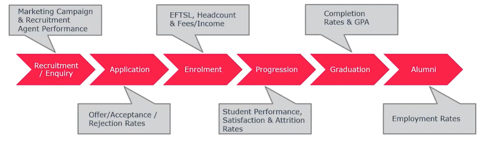
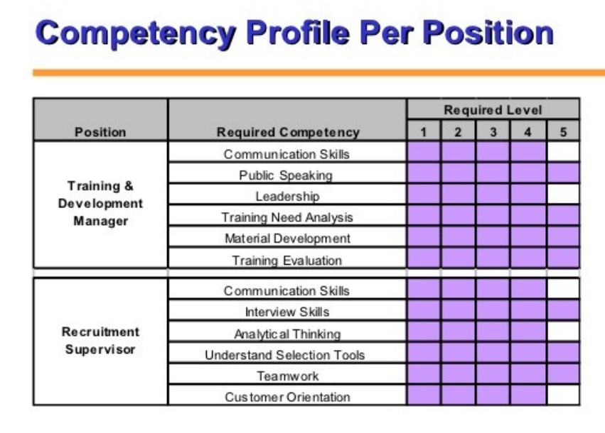
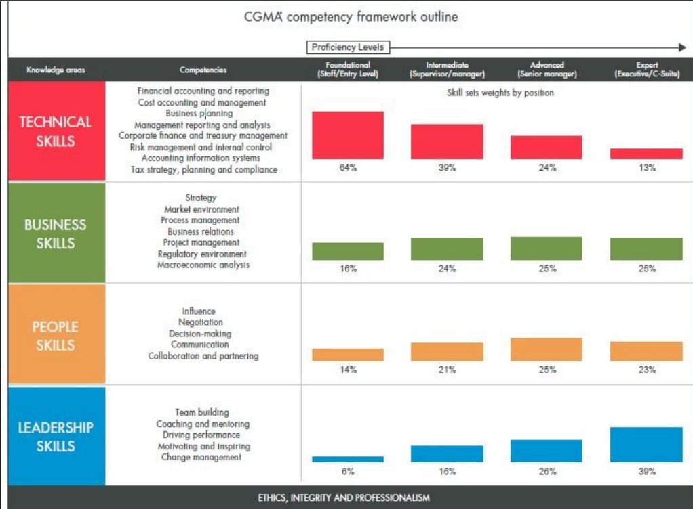

# Keyword: Student Academic Data Modeling, Skill Mapping, Competency Profile Generation, Skill Inference

## 1. Khái niệm

### 1.1 Student Academic Data Modeling

- Student Academic Data Modeling làm một cách cấu trúc lại dữ liệu liên quan về giáo dục như thông tin cá nhân, sơ yếu lí lịch, nhân khẩu học, lớp học, các yếu tố hành vi khác.

### 1.2 Skill Mapping

- Skill Mapping là một kỹ thuật xác định, phân tích và trực quan hóa các kỹ năng, năng lực của một công việc cụ thể hoặc của một cá nhân cụ thể như nhân viên trong công ty hoặc ứng viên tuyển dụng.

- Final Production của nó có thể là một sản phẩm trực quan như mind map thể hiện các kỹ năng của nhân viên.

### 1.3 Competency Profile Generation

- Competency Profile là một tập dữ liệu có cấu trúc thể hiện các kỹ năng, kiến thức và hành vi cụ thể đáp ứng được yêu cầu của một vị trí hay tổ chức cụ thể.

- Competency Profile Generation là phương pháp tạo ra Competency Profile cho một vị trí hay tổ chức cụ thể.

### 1.4 Skill Inference

- Skill Inference là một quy trình hoạt động dựa trên dữ liệu thông qua việc xác định và chuyển đổi khả năng thực tế của cá nhân bằng những thông tin về kinh nghiệm, dự án trong quá khứ.

- Nó sử dụng các mô hình trong NLP để có thể trích xuất được ngữ cảnh và những kỹ năng quan trọng từ đoạn văn.

---

## 2. Mục đích sử dụng

### 2.1 Student Academic Data Modeling

- Việc tái cấu trúc lại dữ liệu liên quan đến giáo dục, học sinh sẽ giúp cho việc phân tích và dự đoán trở nên tốt hơn.

- Dựa vào dữ liệu đó, các nhà phân tích có thể áp dụng các tools như SQL, Power BI để phân tích ra insight hay dùng các mô hình Machine Learning như Random Forest, XGBoost để dự những học sinh có nguy cơ fail môn học, nghỉ học hay cải thiện các phương pháp dạy học.

### 2.2 Skill Mapping

- Mục đích của nó là có thể hiểu được khả năng của nhân viên, ứng viên và giá trị của doanh nghiệp.

- Xác định được liệu các kỹ năng của ứng viên có thể đáp ứng được như cầu của doanh nghiệp hay không.

### 2.3 Competency Profile Generation

- Mục đích là giúp tạo ra được các Competency Profile chỉ ra những điều cần có của một cá nhân để có thể đáp ứng và hoàn thành tốt được, đóng vai trò như một bảng yêu cầu dùng để tuyển dụng hay quản lí hiệu suất của dự án.

### 2.4 Skill Inference

- Mục đích là để phân tích dữ liệu, trích xuất ra được thông tin có ngữ nghĩa về kỹ năng và chuyên môn của ứng viên.

---

## 3. Cấu trúc và thành phần

### 3.1 Student Academic Data Modeling

- Các thành phần chính cần để có thể cấu trúc được dữ liệu giáo dục liên qua đến học sinh:
  - Thông tin học sinh: các thông tin nhân khẩu học, thông tin cá nhân,...
  - Thông tin hành vi học tập, sinh hoạt trong ngày như số giờ học trong ngà, số giờ ngủ trong ngày,...
  - Kết quả gần nhất: điểm số quá khứ, điểm số học kỳ hiện tại.

- Dưới đây là vòng đời của học sinh:
<div align="center">
     
</div>

### 3.2 Skill Mapping

- Các bước tiến hành Skill Mapping:
  1. Xác định mục tiêu xem đối tượng đang áp dụng là cá nhân hay dự án, doanh nghiệp cụ thể
  2. Phân loại Kỹ năng: Lập danh sách có cấu trúc như bảng về các kỹ năng cần thiết, kiến thức chuyên môn và năng lực hành vi.
  3. Đánh giá: Đo lường trình độ thông thạo hiện tại thông qua đánh giá của quản lý, các nền tảng kiểm tra kỹ năng hoặc tự đánh giá.
  4. Tạo bảng, ma trận trực quan hóa dữ liệu bằng cách đặt nhân viên/vai trò vào các hàng và kỹ năng vào các cột để thấy rõ được những nhân viên/vai trò nào cần/thiếu những kỹ năng nào.

### 3.3 Competency Profile Generation

- Để tạo ra được Competency Profile cần 3 bước chính:
  1. Xác định những yêu cầu cụ thể của công việc bao gồm:
  - Tasks và KPIs trong ngày.
  - Kỹ năng cứng và kỹ năng mềm.
  2. Xác định các năng lực chính khoảng 6-8 năng lực chính mà công việc yêu cầu. Bên cạnh đó nên định nghĩa các mức độ của năng lực để đánh giá một cách chính xác nhất.
  3. Đánh giá và Tự động hóa
  - Tham khảo các bên liên quan: Thu thập ý kiến từ các trưởng nhóm, những người đang giữ vị trí công việc hiện tại để đảm bảo hồ sơ thực tế.
  - Tận dụng công cụ AI: Sử dụng các nền tảng chuyên biệt để dễ dàng tạo ra các khung của Competency Profile.

- Các mẫu của một Competency Profile:
<div align="center">
     
</div>

<div align="center">
     
</div>

### 3.4 Skill Inference

- Sau khi data được tiền xử lý, các thuật toán NLP sẽ trích xuất các thông tin có nghĩa về kỹ của ứng viên
- Việc sử dụng các thuật toán NLP sẽ giúp nó chuyển từ dữ liệu phi cấu trúc thành dữ liệu có cấu trúc.
- Kết quả nhận được sẽ là các thông tin liên quan đến kỹ năng và chuyên môn của các nhân viên trong công ty hoặc các ứng viên tuyển dụng.

---

## 4. Mối quan hệ giữa Student Academic Data Modeling, Skill Mapping, Competency Profile Generation, Skill Inference

- Mối quan hệ của chúng như sau:

```text
1. Student Academic Data Modeling: lưu trữ dữ liệu học tập

2. Skill Inference: AI suy luận kỹ năng từ dữ liệu

3. Skill Mapping: ghép kỹ năng vào khung kỹ năng chuẩn

4. Competency Profile Generation: tạo hồ sơ năng lực của sinh viên
```

---

## 5. Ví dụ minh họa

```text
1. Điểm số các môn học của sinh viên.

Sinh viên 1
GPA: 3.7
OOP: A
Web API: B+
C#: A

2. Student Academic Data Modeling: Chuyển các điểm số, môn học trên giấy tờ thành các bảng dữ liệu có cấu trúc.

3. Skill Inference: AI suy luận kỹ năng từ dữ liệu

ASP.NET Core
REST API
Entity Framework
Docker
Git

3. Skill Mapping: ghép kỹ năng vào khung kỹ năng chuẩn

Backend: 5/5

Database: 4/5

Docker: 3/5

4. Competency Profile Generation: tạo hồ sơ năng lực của sinh viên

Backend Developer: Match 84%

Full-Stack Developer: Match 30%
```

---

## 6. Ưu điểm

### 6.1 Student Academic Data Modeling

- Giúp cho các nhà phân tích dễ dàng phân tích hành vi của học sinh và đưa ra insight, xu hướng để cải thiện được tình hình học tập và chất lượng giảng dạy.

### 6.2 Skill Mapping

- Xác định được những kỹ năng cần thiết cho dự án, doanh nghiệp

- Giúp dễ dàng trong việc tuyển nhân sự hay sắp xếp team trong một dự án để phân bổ module cho đúng team có skill về phần đó.

### 6.3 Competency Profile Generation

- Giúp tạo ra nhánh chóng phần khung của một hồ sơ năng lực, chỉ cần chỉnh sửa lại và bắt đầu thực hiện đánh giá.

### 6.4 Skill Inference

- Skill Inference giúp quản lý nhân lực tốt hơn khi biết được kỹ năng của chuyên môn của từng người.

- Có thể lên kế hoạch làm việc hiệu quả cho các team.

---

## 7. Hạn chế

### 7.1 Student Academic Data Modeling

- Học sinh, sinh viên ở mỗi khu vực / quốc gia sẽ có thông tin nhân khẩu học hay hành vi học tập và khác nhau.

- Cần một số lượng thông tin vô cùng lớn để có thể phân tích và dự đoán tốt.

### 7.2 Skill Mapping

- Cần người hiểu về domain để có thể map từ cv của ứng viên hay yêu cầu của dự án thành các kỹ năng phù hợp với các yêu cầu đó.

- Trực quan hóa phải rõ ràng cụ thể, đưa ra được những kỹ năng cụ của mỗi cá nhân hoặc dự án.

### 7.3 Competency Profile Generation

- Đôi khi AI tạo ra các hồ sơ năng lực lệch so với yêu cầu của công việc dẫn đến đánh giá ko đúng năng lực của ứng viên. Do khi khi tạo ra người dùng phải kiểm tra kỹ lại trước khi dùng.

### 7.4 Skill Inference

- Việc sử dụng hay thiết lập mô hình không tốt sẽ khiến cho việc suy luận ra skill bị sai hay chỉ là những skill chung chung khiến cho việc sử dụng skill này để đánh giá là không hợp lý.

---

## 8. Kiến thức học được

- Em hiểu được cách tổ chức dữ liệu học tập của sinh viên để phục vụ phân tích và xây dựng mô hình AI.
- Hiểu được vai trò của Skill Inference trong việc suy luận kỹ năng từ dữ liệu phi cấu trúc như CV, báo cáo dự án hoặc kết quả học tập.
- Nắm được Skill Mapping giúp liên kết các kỹ năng suy luận được với khung kỹ năng chuẩn.
- Hiểu được Competency Profile Generation là bước tổng hợp các kỹ năng và mức độ thành thạo thành hồ sơ năng lực phục vụ đánh giá hoặc gợi ý nghề nghiệp.

---

## 9. Khó khăn gặp phải

- Ban đầu em khá khó phân biệt giữa Skill Mapping và Skill Inference vì cả hai đều liên quan đến kỹ năng. Sau khi tìm hiểu thêm, em hiểu rằng Skill Inference là quá trình AI suy luận và trích xuất kỹ năng từ dữ liệu, còn Skill Mapping là quá trình đối chiếu các kỹ năng đó với một khung kỹ năng chuẩn.
- Em cũng gặp khó khi phân biệt Competency Profile Generation và Competency Framework. Sau khi nghiên cứu, em hiểu Competency Framework là bộ tiêu chuẩn năng lực, còn Competency Profile là hồ sơ năng lực của một cá nhân được xây dựng dựa trên bộ tiêu chuẩn đó.
