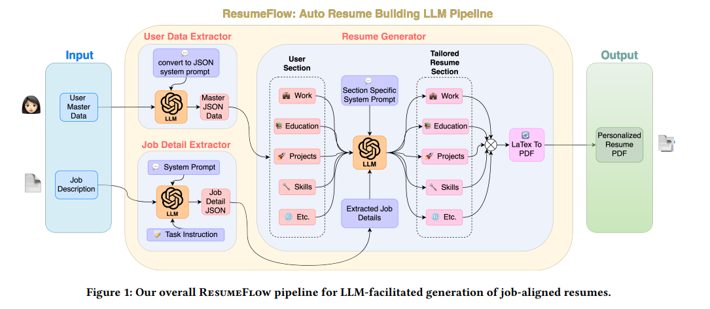
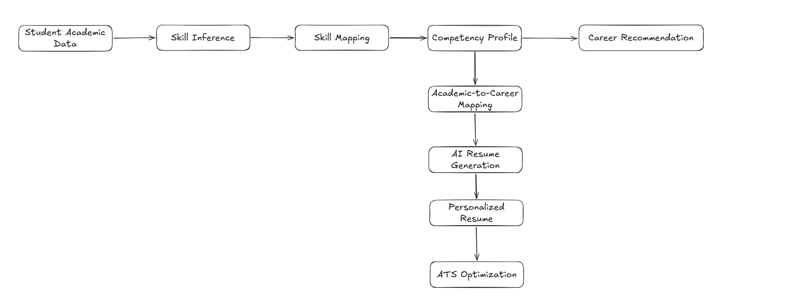
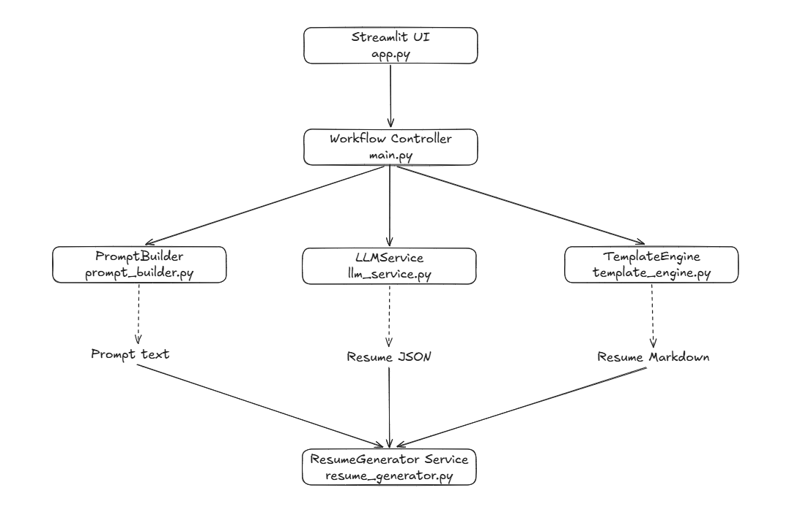
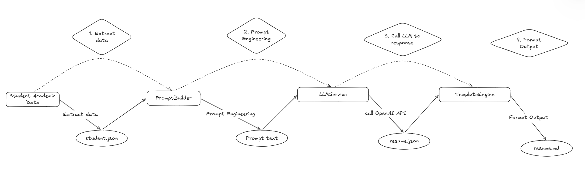

# Keyword: AI Resume Generation, Resume Template Generation, ATS Resume Optimization, Personalized Resume Generation, Academic-to-Career Mapping, Career Recommendation System

## 1. Khái niệm

### 1.1 AI Resume Generation

- AI Resume Generation là phương pháp tạo các hồ sơ cá nhân, hồ sơ sinh việc (CV) tự động bằng các tools AI.

- Các tools này sẽ phân tích lịch sử công việc của bạn và mô tả công việc ở vị trí bạn ứng tuyển để tạo ra bản CV hợp lý.

### 1.2 Resume Template Generation

- Resume Template Generation là quy trình sử dụng phần mềm, AI để tạo một layout, template phù hợp cho resume.

### 1.3 ATS Resume Optimization

- ATS Resume Optimization Là quy trình chỉnh sửa và định dạng hồ sơ, giúp cho phần mềm sàng lọc bằng AI của nhà tuyển dụng có thể dễ dàng đọc, phân tích cú pháp và xếp hạng.

### 1.4 Personalized Resume Generation

- Personalized Resume Generation là quy trình sử dụng phần mềm, AI để tạo một sinh CV được tối ưu riêng cho một JD cụ thể..

### 1.5 Academic-to-Career Mapping

- Academic-to-Career Mapping là một quy trình chuyển từ quá trình học tập của sinh viên như chuyên ngành, khóa học, project, điểm số thành các vị trí công việc cụ thể.

### 1.6 Career Recommendation System

- Career Recommendation System là một hệ thống AI phân tích thông tin cá nhân của một người như kỹ năng, học vấn, sở thích và gợi ý những con đường sự nghiệp hợp lý.

---

## 2. Mục đích sử dụng

### 2.1 AI Resume Generation

- Mục đích là để tạo ra bản CV nháp, tự động cho người dùng.

### 2.2 Resume Template Generation

- Nó hỗ trợ tạo ra các layout cho CV.

### 2.3 ATS Resume Optimization

- Giúp cho CV được format chỉnh chu và dễ đọc trước các tool AI và trước nhà tuyển dụng.

### 2.4 Personalized Resume Generation

- Mục đích là để tạo ra bản CV từ user data và JD và pass được Applicant Tracking Systems (ATS) cũng như ăn điểm với nhà tuyển dụng.

### 2.5 Academic-to-Career Mapping

- Mục đích của nó là để tạo ra các định hướng công việc, vị trí công việc phù hợp với ngành đang học.

### 2.6 Career Recommendation System

- Tương tụ với Academic-to-Career Mapping, mục đích là để tạo ra các định hướng công việc, vị trí công việc phù hợp với ngành đang học

---

## 3. Cấu trúc và thành phần

### 3.1 AI Resume Generation

- Các thành phần chính của AI Resume Generation bao gồm:
  - User Data Extractor: thành phần có nhiệm vụ convert các file do người dùng gửi thành định dạng JSON có cấu trúc.
  - Job Details Extractor: có nhiệm vụ phân tích JD, nó sẽ trích xuất ra các keywords, yêu cầu cần thiết và trả về định dạng JSON có cấu trúc.
  - Resume Generator: nó sẽ tận dụng các file JSON chứa user data từ User Data Extractor và file JSON chứ thông tin quan trọng được trích xuất từ JD, từ đó có thể tạo được CV.

- Luồng hoạt động của AI Resume Generation:
<div align="center">
     
</div>

### 3.2 Resume Template Generation

- Thành phần hoạt động như sau:
  - Resume Templates
  - Layout Selector
  - Formatting Engine
  - Output PDF

### 3.3 ATS Resume Optimization

- Để tối ưu CV của mình tránh các ATS khó đọc và chấm điểm thấp cần lưu ý:
  - Chọn các layout đơn giản: tránh các cột, bảng , hình ảnh, biểu đồ, ...
  - Đưa ra các đề mục tiêu chuẩn ở mỗi phần như: Work Experience, Education, Project, ...

- ATS thường chấm điểm theo keyword nên khi viết phải lưu ý các điều sau:
  - Viết keyword kèm theo ngữ cảnh, cách sử dụng áp dụng nó như nào vào project.
  - Viết đầy đủ các từ viết tắt.

### 3.4 Personalized Resume Generation

- Thành phần hoạt động như sau:
  - AI Content Creation: công cụ để phân tích JD để đưa ra các skill, requirements cần thiết cho công việc, thường được liệt kê ở dạng bullet point.
  - ATS Optimization: Các Layout được thiết kế trong qua Applicant Tracking Systems.
  - Instant Formatting: cho phép người dụng, chỉnh sửa lại CV.

### 3.5 Academic-to-Career Mapping

- Cách nó hoạt động như sau:
  - Xác định các ngành nghề phù hợp với chuyên ngành của bạn.

  - Phân tích kỹ năng: đưa ra các kỹ năng mà cần thiết mà được học trong chương trình mà những skill đó được HR tìm kiếm.

  - Đưa ra kế hoạch nghề nghiệp tương lai và đưa ra các projects giúp cải thiện skills.

### 3.6 Career Recommendation System

- Các thành phần chính:
  - Profile Analysis: lấy những data về lịch sử học vấn, trình độ kỹ thuật và sở thích qua đó đưa ra đánh giá.
  - Machine Learning / Dee Algorithms: Xây dựng các mô hình máy học, học sâu để phân tích và dự đoán thông qua các bộ data trên kaggle.
  - Skill Gap Identification: xác định các kỹ năng cần thiết và những chứng chỉ cung cấp hoàn thiện kỹ năng đó.

---

## 4. Mối quan hệ giữa Student Academic Data Modeling, Skill Mapping, Competency Profile Generation, Skill Inference

- Mối quan hệ của chúng như sau:
<div align="center">
     
</div>

---

## 5. Ví dụ minh họa

```text
Input: Student Academic Data

GPA

3.6

Projects: RAG, Chatbot

Skills: Python, PyTorch, NLP, FastAPI

↓

Skill Inference: Python, Machine Learning, Deep Learning, REST API

↓

Skill Mapping: AI Engineer

↓

Resume Generation

↓

ATS Optimization

↓

Output: Resume
```

---

## 6. Ưu điểm

### 6.1 AI Resume Generation

- Giúp dễ dàng và nhanh chóng tạo ra được CV dựa vào điểm số, project quá khứ của người dùng và JD từ công ty.

### 6.2 Resume Template Generation

- Giúp dễ dàng và nhanh chóng tạo ra được CV dựa vào điểm số, project quá khứ của người dùng và JD từ công ty.

### 6.3 ATS Resume Optimization

- Giúp tạo chỉnh sửa lại định dạng của CV giúp cho các ATS dễ đọc và chấm điểm.

### 6.4 Personalized Resume Generation

- Giúp dễ dàng và nhanh chóng tạo ra được CV dựa vào điểm số, project quá khứ của người dùng và JD từ công ty.

- Giúp dễ dàng pass các vòng kiểm tra của ATS.

### 6.5 Academic-to-Career Mapping

- Giúp cho người học hình dung được mình sẽ phù hợp với công việc nào trong tương lai và đưa ra định hướng để phát triển.

### 6.6 Career Recommendation System

- Giúp cho sinh viên có cái nhìn trực quan hơn về các con đường sự nghiệp và chọn được việc làm tốt hơn.

---

## 7. Hạn chế

### 7.1 AI Resume Generation

- Cần đưa ra các system prompt chặt chẽ hợp lý ở các thành phần như User Data Extractor, Job Details Extractor, Resume Generator, nếu không thì một mắc xích trích xuất thông tin hay tổng hợp các thông tin không tốt sẽ cho CV không đạt kỳ vọng.

### 7.2 Resume Template Generation

- Cần người hiểu về domain để có thể config được luồng hoạt động hiệu quả.

### 7.3 ATS Resume Optimization

- Đôi khi việc tối ưu hóa điều chỉnh phần keyword có thể làm mất tính mạch lạc, cá nhân của CV.

### 7.4 Personalized Resume Generation

- Cần người hiểu về domain để có thể config được luồng hoạt động hiệu quả.

### 7.5 Academic-to-Career Mapping

- Nếu quá phụ thuộc vào AI để mapping có thể dẫn đến sai sót và chọn sai ngành không phù hợp.

### 7.6 Career Recommendation System

- Nếu quá phụ thuộc và AI có thể dẫn đến sai sót và chọn sai ngành không phù hợp.

---

## 8. Kiến thức học được

- Em hiểu được quy trình AI tạo CV từ dữ liệu người học và JD.

- Hiểu được sự khác nhau giữa AI Resume Generation và Personalized Resume Generation.

- Hiểu được cách ATS đánh giá CV và các nguyên tắc tối ưu.

- Hiểu được cách Academic-to-Career Mapping và Career Recommendation hỗ trợ định hướng nghề nghiệp.

- Hiểu được mối liên hệ giữa Skill Mapping, Competency Profile và AI Resume Generation.

---

## 9. Khó khăn gặp phải

- Ban đầu em khá khó phân biệt giữa AI Resume Generation và Personalized Resume Generation vì cả hai đều sử dụng AI để tạo CV.Sau khi tìm hiểu, em hiểu rằng AI Resume Generation chỉ tập trung vào việc sinh nội dung CV, trong khi Personalized Resume Generation còn phân tích Job Description để điều chỉnh nội dung phù hợp với từng vị trí tuyển dụng.

- Ngoài ra em cũng gặp khó khăn khi phân biệt Academic-to-Career Mapping và Career Recommendation System. Sau khi nghiên cứu, em hiểu rằng Academic-to-Career Mapping là quá trình liên kết chương trình học với các nghề nghiệp phù hợp, còn Career Recommendation System sử dụng dữ liệu người học và các thuật toán AI để xếp hạng và đề xuất những nghề nghiệp phù hợp nhất.

## 10. Demo

- Ở phần này em có demo một luồng tạo ra CV từ một file json chứa Student Academic Data.

- Kiến trúc đồ án:
<div align="center">
     
</div>

- Luồng hoạt động:
<div align="center">
     
</div>
